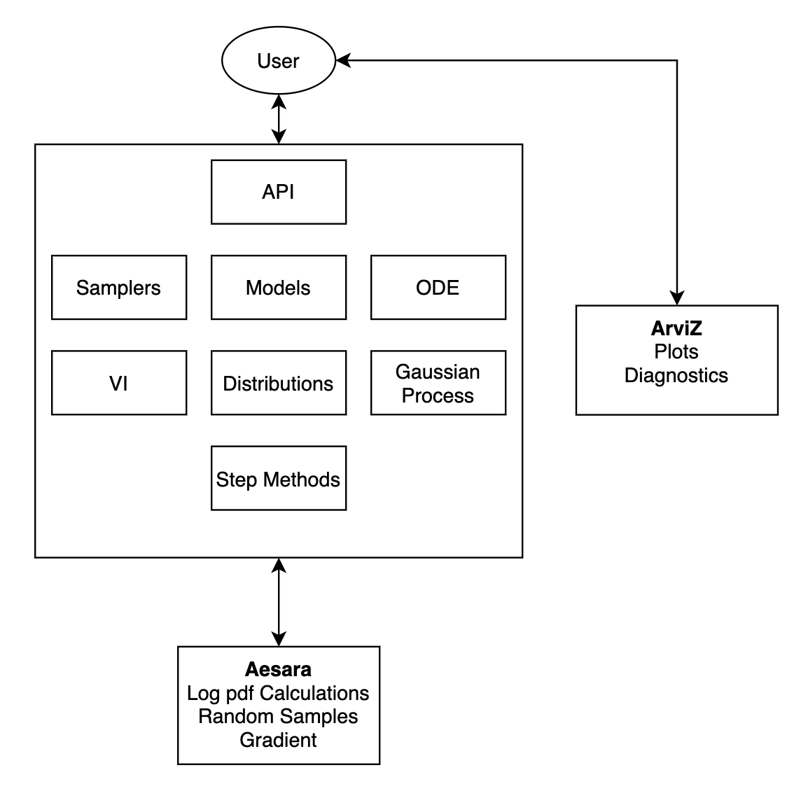

# Architecture
This document describes the high-level architecture of PyMC.

# Bird's Eye View
[comment]: <> (https://drive.google.com/file/d/1lfEzokkNUJr_JIeSDQfha5a57pokz0qI)

Lets you define probabilistic graphs or models that can be easily used to compute log probabilities for posterior
inference or to draw random samples for prior and posterior prediction.

PyMC includes a few inference techniques, in particular:
* Markov chain Monte Carlo
* Variational Inference
* Sequential Monte Carlo

It also contains numerous others pieces of functionality such as GraphviZ model visualization tools
as well as various mathematical helper functions.

The most central pieces functionality of PyMC are shown visually below, as well as their
relation to other major packages. Not all modules are shown, either because
they are smaller or self explanatory in scope, or they're pending
deprecation

## Functionality not in PyMC
It is easier to start with functionality that is not present in PyMC but
rather deferred to outside libraries. If seeking to understand any
of the topics below refer to that specific library

### PyTensor
* Gradient computation
* Random number generation
* Low level tensor operation definition
* Low level operation graphs

### ArviZ
* Plotting e.g. Trace plots, rank plots, posterior plots
* MCMC sampling diagnostics e.g. Rhat, Effective Sample Size.
* Model comparison, particularly efficient leave-one-out cross-validation approximation
* Inference Data structure


# Modules
The codebase of PyMC is split among single Python file modules at the root
level, as well as directories with Python code for logical groups of functionality.
Admittedly the split between single `.py` module or directory is not defined by a strict
criteria but tends to occur when single `.py` files would be "too big".
We will with the modules needed implement "simple MCMC" model shown below
before detailing the remaining modules, such as Variational Inference, Ordinary Differential Equations,
or Sequential Monte Carlo.

```python
with pm.Model() as model:
  theta = pm.Beta("theta", alpha=1, beta=2)
  p = pm.Beta("n", p=theta, n=2, observed=[1,2])
  inf_data = pm.sample()


```

## {mod}`pymc.model`
Contains primitives related model definition and methods used for evaluation of the model.
In no particular order they are

* `ContextMeta`: The context manager that enables the `with pm.Model() as model` syntax
* {class}`~pymc.Factor`: Defines the methods for the various logprobs for models
* `ValueGrad` which handles the value and gradient and is the main connection point to PyTensor
* `Deterministic` and `Potential`: Definitions for two pieces of functionality useful in some model definitions

## distributions/
Contains multiple submodules that define distributions,  as well as logic that aids in distributions usage.
Important modules to note are

* `distribution.py`: This contains parent class for all PyMC distributions.
  Notably the `distribution.distribution` class contains the `observed` argument which in PyMC differentiates
  a random variable distribution from a likelihood distribution.

* `logprob.py`: This contains the log probability logic for the distributions themselves.
  The log probability calculation is deferred to PyTensor

* `dist_math.py`: Various convenience operators for distributions.
  This includes mathematical operators such as `logpower` or `all_true`methods.
  It also contains a suite of lognormal methods and transformation methods

## /sampling.py
Interface to posterior, prior predictive, and posterior sampling as well as various methods to identify and initialize
stepper methods. Also contains logic to check for "all continuous" variables and initialize NUTS

## step_methods/
Contains various step methods for various sampling algorithms, such as MCMC, and SMC. `step_methods.hmc` includes
the Hamiltonian Monte Carlo sampling methods as well as helper functions such as the integrators used for those methods

## tests/
All tests for testing functionality of codebase. All modules prefixed with `test_` are tests themselves, whereas all
other modules contain various supporting code such as fixtures, configurations, etc
