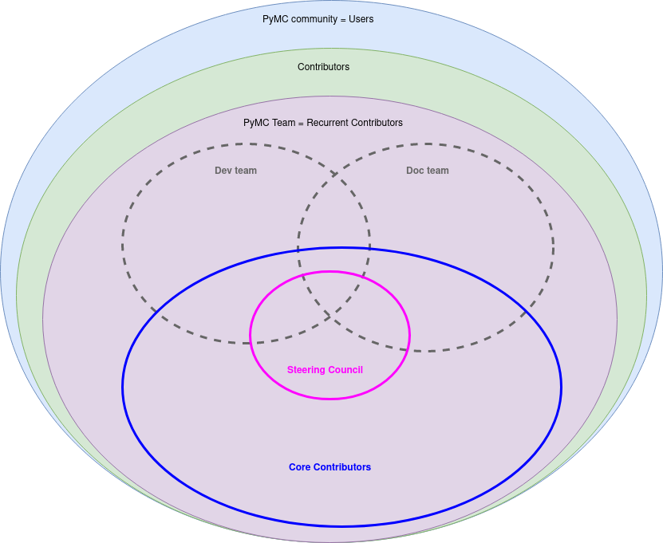

# Main Governance Document

## The Project

The PyMC Project (The Project) is an open source software project
affiliated with the 501c3 NumFOCUS Foundation. The goal of The Project is to
develop open source software and deploy open and public websites and services
for reproducible, exploratory and interactive computing.
The main focus of The Project is in scientific and statistical computing.
The Software developed
by The Project is released under OSI approved open source licenses,
developed openly and hosted in public GitHub repositories under the
[pymc-devs GitHub organization](https://github.com/pymc-devs). Examples of
Project Software include the PyMC library and its documentation, etc.
The Services run by The Project consist of public websites and web-services
that are hosted at [http://www.pymc.io](https://www.pymc.io) and subdomains.

The Project is developed by a team of distributed developers, called
Contributors. Contributors are individuals who have contributed code,
documentation, designs or other work to one or more Project repositories,
or who have done significant work to empower the Community,
participating on [Discourse](https://discourse.pymc.io),
organizing [PyMCon](https://pymcon.com) or helped on other platforms and events.
**Anyone can be a Contributor.**
Contributors can be affiliated with any legal entity or none.
The foundation of Project participation is openness and transparency.

There have been over 250 Contributors to the Project, their contributions are listed in the
logs of the PyMC GitHub repositories as well as those of associated projects and venues.

The Project Community consists of all Contributors and Users of the Project.
Contributors work on behalf of and are responsible to the larger Project
Community and we strive to keep the barrier between Contributors and Users as
low as possible.

The Project is formally affiliated with the 501c3
[NumFOCUS Foundation](http://numfocus.org), which serves as its fiscal
sponsor, may hold project trademarks and other intellectual property, helps
manage project donations and acts as a parent legal entity. NumFOCUS is the
only legal entity that has a formal relationship with the project (see
Institutional Partners section below).

## Governance

This section outlines the governance and leadership model of The Project.

The foundations of Project governance are:

- Openness & Transparency
- Active Contribution
- Institutional Neutrality

Traditionally, Project leadership was provided by a BDFL (Chris Fonnesbeck) and
subset of Contributors, called Core Developers, whose active and consistent
contributions have been recognized by their receiving “commit rights” to the
Project GitHub repositories. In general all Project decisions were made through
consensus among the Core Developers with input from the Community. The BDFL
could, but rarely chose to, override the Core Developers and make a final
decision on a matter.

While this approach served us well, as the Project grew and faced more
legal and financial decisions and interacted with other institutions, we saw a
need for a more formal governance and organization model.
We view this governance model as the formalization of what we were already doing,
rather than a change in direction.

## Community and Team Architecture
The PyMC community is organized in an onion-like fashion.
The tiers relevant to the project governance are listed below sorted by
increasing responsibility. Due to the onion-like structure, members of a group are
also members of all the groups listed above:

* Contributors
* Recurring Contributors
* Core Contributors
* Steering Council
* BDFL

Core Contributors comprise what we understand as the PyMC Team.
The Team will generally act as a single unit, except for some specific
questions where dedicated teams will prevail.
The PyMC project currently has Developer, Documentation and Community teams.
Team members can be part of one, some or none of these dedicated teams.
The diagram below should help illustrate this idea.

Anyone working with The Project has the responsibility to personally uphold
the Code of Conduct. Core Contributors have the additional responsibility
of _enforcing_ the Code of Conduct to maintain a safe community.

## Recurring Contributors
Recurring Contributors are those individuals who contribute recurrently to the
project and can provide valuable insight on the project.
They are therefore actively consulted and can participate in the same communication
channels as Core Contributors. However, unlike Core Contributors,
Recurrent Contributors don't have voting, managing or writing rights.

In practice, this translates in participating from private team discussions
(i.e. in Slack or live meetings) but not being able to vote Steering Council
members nor having commit rights on GitHub.

The Recurrent Contributor position will often be an intermediate step for people
in becoming Core Contributors once their contributions are frequent enough
and during a sustained period of time.
But it is also an important role by itself for people who want to be part of
the project on a more advisory-like role, as they for example might not have
the time availability or don't want the responsibilities that come
with being a Core Contributor.

### Recurring Contributor membership
Recurring Contributors can nominate any Contributor to participate in the
Project private communication channels (i.e. Slack public channel)
and become a Recurring Contributor.
For the nomination to go forward, it has to be ratified by the Steering Council.
For a nomination to be rejected, clear reasoning behind the decision must be
shared with the rest of the team. People whose nomination has been rejected can
be nominated at any time again in the future, three months after the previous
nomination at the earliest. The nomination process is explained below
in more detail in a section of its own.

Interns and contractors are added to the team as Recurrent Contributors.
We consider the selection/hiring process to replace the nomination process.
This applies to Google summer of code interns or Google season of
docs contractors, but also to interns and contractors hired by
tier 1 Institutional Partners who work mostly on PyMC.

## Core Contributors
Core Contributors are those individuals entrusted with the development and
well being of the Project due to their frequency of quality contributions over
a sustained period of time.

They are the main governing and decision body
of the Project and are therefore given voting and managing rights to the Project
services (i.e. commit rights on GitHub or moderation rights on Discourse).

Team memberships for Core Contributors refer to their Core Contributor
role, as experienced and entrusted members of the team they are considered
Recurrent Contributors for the rest of the teams and given permissions accordingly

The exact permissions of all Core Contributors may therefore not be the same
and depend on their team memberships. Even if they have commit rights,
Core Contributors should still have their pull requests reviewed by at least
one other Core Contributor before merging.
In rare circumstances, a Core Contributor may bypass this review
if in their best judgement it is appropriate to do so,
but such expedited PR merges must be justifiable and
ultimately subject to review post hoc, if necessary.
If overstepping, Core Contributors can also be subject to a vote
of no confidence (see below) and see their permissions revoked.

### Core Contributor membership
To become a Core Contributor, one must already be a Recurring Contributor.
Core Contributors can nominate any Recurring Contributor to become a
Core Contributor. For the nomination to go forward, it has to be
ratified by the Steering Council.
For a nomination to be rejected, clear reasoning behind the decision must be
shared with the rest of the team. People whose nomination has been rejected can
be nominated at any time again in the future, three months after the previous
nomination at the earliest. The nomination process is explained below
in more detail in a section of its own.

### Current Core Contributors
Contributors who are also part of a dedicated team or are institutional
contributors will have so indicated after their name.

Dedicated teams only cover a small part of the work needed to
get the project going, tasks like fundraising, outreach or marketing
for example don't (yet) have a dedicated team.
Contributors don't need to be part of any dedicated team.

* Adrian Seyboldt (dev - PyMC Labs)
* Alex Andorra (dev - PyMC Labs)
* Austin Rochford
* Ben Mares
* Benjamin Vincent (docs - PyMC Labs)
* Bill Engels (dev)
* Chris Fonnesbeck (dev, docs)
* Christian Luhmann (community)
* Colin Carroll (dev)
* Eelke Spaak (dev)
* Eric Ma (dev - PyMC Labs)
* Fernando Irarrazaval (community)
* George Ho (dev)
* Junpeng Lao (dev, community)
* Larry Dong (dev)
* Luciano Paz (dev - PyMC Labs)
* Martina Cantaro (docs)
* Maxim Kochurov (dev - PyMC Labs)
* Meenal Jhajharia (docs, community)
* Michael Osthege (dev)
* Oriol Abril-Pla (docs, community)
* Osvaldo Martin (dev, docs)
* Purna Chandra Mansingh (community)
* Ravin Kumar (dev, community, docs)
* Reshama Shaikh (community - PyMC Labs)
* Ricardo Vieira (dev, community)
* Robert P. Goldman (dev)
* Rob Zinkov (dev, community)
* Sandra Meneses (community)
* Sayam Kumar (dev, docs)
* Thomas Wiecki (dev, community - PyMC Labs)
* Virgile Andreani  (dev)

## Steering Council

The Project will have a Steering Council that consists of Project Contributors
who have produced contributions that are substantial in quality and quantity,
and sustained over at least one year. The overall role of the Council is to
ensure, through working with the BDFL and taking input from the Community, the
long-term well-being of the project, both technically and as a community.

The Steering Council will have between 4 and 7 members with at least one member
per dedicated team.
No more than 2 Council Members can report to one person or company
(including Institutional Partners) through employment or
contracting work (including the reportee, i.e. the reportee + 1 is the max).

During the everyday project activities, council members participate in all
discussions, code review and other project activities as peers with all other
Contributors and the Community. In these everyday activities, Council Members
do not have any special power or privilege through their membership on the
Council. However, it is expected that because of the quality and quantity of
their contributions and their expert knowledge of the Project Software and
Services that Council Members will provide useful guidance, both technical and
in terms of project direction, to potentially less experienced contributors.

The Steering Council and its Members play a special role in certain situations.
In particular, the Council may:

- Make decisions about the overall scope, vision and direction of the
  project.
- Make decisions about strategic collaborations with other organizations or
  individuals.
- Make decisions about specific technical issues, features, bugs and pull
  requests.
- Make decisions about the Services that are run by The Project and manage
  those Services for the benefit of the Project and Community.
- Make decisions when regular community discussion doesn’t produce consensus
  on an issue in a reasonable time frame.

### Current Steering Council

The current Steering Council membership comprises:

- Chris Fonnesbeck (dev, docs)
- Junpeng Lao (dev, community)
- Oriol Abril-Pla (docs, community)
- Ravin Kumar (dev, community, docs)
- Thomas Wiecki (dev, community - PyMC Labs)

Note that as explained in the [community architecture section](#community-and-team-architecture)
and as indicated again in the description of the Steering Council above,
Council members are first and foremost Core Contributors, and have no special
power or privilege in everyday activities.
To emphasize that, Steering Council members are listed both in the current core
contributors section and in this section even if redundant.

### Council membership

To become eligible for being a Steering Council Member an individual must be a
Core Contributor who has produced contributions that are substantial in
quality and quantity, and sustained over at least one year.

Similarly to when nominating new team members, when considering potential
Council Members one should look at candidates with a
comprehensive view of their contributions. This will include but is not limited
to code, code review, infrastructure work, forum and chat participation,
community help/building, education and outreach, design work, etc. We are
deliberately not setting arbitrary quantitative metrics (like “100 commits in
this repo”) to avoid encouraging behavior that plays to the metrics rather than
the project’s overall well-being. We want to encourage a diverse array of
backgrounds, viewpoints and talents in our team, which is why we explicitly do
not define code as the sole metric on which council membership will be
evaluated. See the section on election process for more details.

Council membership is assigned for a two year period, with no limit on how many
periods can be served.

Council members can renounce at any time and are
encouraged to do so if they foresee they won't be able to attend their
responsibilities for an extended interval of time.

If a Council member becomes inactive in the project for a period of six months,
they will be considered for removal from the Council. Before removal, inactive
Member will be approached by the BDFL to see if they plan on returning to
active participation. If not they will be removed immediately, as they
are effectively renouncing to their position.
If they plan on returning to active participation soon, they will be
given a grace period of six months. If they don’t return to active participation
within that time period they will be removed without
further grace period. All former Council members can be considered for
membership again at any time in the future.
Retired Council members will be listed on the project website, acknowledging
the period during which they were active in the Council.

The Council reserves the right to eject current Members, other than the BDFL,
if they are deemed to be actively harmful to the project’s well-being, and
attempts at communication and conflict resolution have failed. See
the section on votes of no-confidence for details on the process.

### Private communications of the Council

Unless specifically required, all Council discussions and activities will be
public and done in collaboration and discussion with the Project Team
and also the Community when possible.
The Council will have a private mailing list that will be used
sparingly and only when a specific matter requires privacy. When private
communications and decisions are needed, the Council will do its best to
summarize those to the Team after eliding personal/private/sensitive
information that should not be posted to the public internet.

### Subcommittees

The Council can create subcommittees that provide leadership and guidance for
specific aspects of the project. Like the Council as a whole, subcommittees
should conduct their business in an open and public manner unless privacy is
specifically called for.

Even if the BDFL does not sit on a specific subcommittee, they still retain
override authority on the subcommittee's decisions. However, it is expected that
they will appoint a delegate to oversee the subcommittee's decisions, and
explicit intervention from the BDFL will only be sought if the committee
disagrees with the delegate's decision and no resolution is possible within the
subcommittee. This is a different situation from a BDFL delegate for a specific
decision, or a recusal situation, in which the BDFL gives up their authority
to someone else in full.

### NumFOCUS Subcommittee

The Council will maintain one narrowly focused subcommittee to manage its
interactions with NumFOCUS.

- The NumFOCUS Subcommittee is comprised of 5 persons who manage project
  funding that comes through NumFOCUS. It is expected that these funds will
  be spent in a manner that is consistent with the non-profit mission of
  NumFOCUS and the direction of the Project as determined by the full
  Council.
- This Subcommittee shall NOT make decisions about the direction, scope,
  technical or financial direction of the Project.

#### NumFOCUS subcommittee membership
This Subcommittee will have 5 members. With at least
2 members being on the Steering Council. No more
than 2 Subcommitee Members can report to one person or company through
employment or contracting work (including the reportee, i.e.
the reportee + 1 is the max).
This avoids effective majorities resting on one person.

Any Core Contributor is eligible for the NumFOCUS subcommittee.

#### Current NumFOCUS Subcommitee
The current NumFOCUS Subcommittee consists of:

- Peadar Coyle
- Chris Fonnesbeck
- John Salvatier
- Jon Sedar
- Thomas Wiecki

## BDFL

The Project will have a BDFL (Benevolent Dictator for Life), who is currently
Chris Fonnesbeck. As Dictator, the BDFL has the authority to make all final
decisions for The Project. As Benevolent, the BDFL, in practice chooses to
defer that authority to the consensus of the community discussion channels and
the Steering Council. It is expected, and in the past has been the
case, that the BDFL will only rarely assert their final authority. Because
rarely used, we refer to BDFL’s final authority as a “special” or “overriding”
vote. When it does occur, the BDFL override typically happens in situations
where there is a deadlock in the Steering Council or if the Steering Council
asks the BDFL to make a decision on a specific matter. To ensure the
benevolence of the BDFL, The Project encourages others to fork the project if
they disagree with the overall direction the BDFL is taking. The BDFL is chair
of the Steering Council (see below) and may delegate their authority on a
particular decision or set of decisions to any other Council member at their
discretion.

The BDFL can appoint their successor, but it is expected that the Steering
Council would be consulted on this decision. If the BDFL is unable to appoint a
successor, the Steering Council will make a suggestion or suggestions to the
Main NumFOCUS Board. While the Steering Council and Main NumFOCUS Board will
work together closely on the BDFL selection process, the Main NUMFOCUS Board
will make the final decision.

## Conflict of interest

It is expected that the BDFL, Council Members and Contributors will be
employed at a wide range of companies, universities and non-profit organizations.
Because of this, it is possible that Members will have conflict of interests.
Such conflict of interests include, but are not limited to:

- Financial interests, such as investments, employment or contracting work,
  outside of The Project that may influence their work on The Project.
- Access to proprietary information of their employer that could potentially
  leak into their work with The Project.

All members of the Council, BDFL included, shall disclose to the rest of the
Council any conflict of interest they may have. Members with a conflict of
interest in a particular issue may participate in Council discussions on that
issue, but must recuse themselves from voting on the issue. If the BDFL has
recused themselves for a particular decision, they will appoint a substitute
BDFL for that decision.

## Voting processes
### Nomination process
> Used when adding members to the team as recurrent or core contributors.

A nomination process is triggered automatically whenever a team member
requests so on one of the team's communication channels
(public Slack channels at the day of writing, preferably `#general`).
Nomination should be explicit regarding which roles and teams are
suggested, but the council makes the final decision on
dedicated team membership.
Again, note that team members don't need to be part of any
dedicated team to be recurrent nor core contributors.

After this happens, the Steering Council will reach out to the candidate
to see if they accept the nomination. If the nomination is accepted
it will be considered by the Steering Council.
At their earliest convenience and no later than two weeks, the Steering
Council will vote on the nominee using the process below on
Steering Council decisions.

Voting will be private to the Steering Council only with results published
on the nomination request.
In the case of a rejection, results must include the reasons behind
the decision (i.e. the time since starting to contribute is deemed
too short for now).

### Steering Council decisions
By and large we expect the decisions in PyMC to be made _ad hoc_
and require little formal coordination and with the community at large.
However, for controversial proposals and new team members the council can
intervene to make the final decision in a group vote.

#### Call for a vote
Core Contributors can call for a vote to resolve a target issue
they feel has been stale for too long and for which
informal consensus appears unlikely.
For a vote to be called, the target issue or discussion post (i.e. on Discourse)
must be at least 1 month old.

To do so, they have to open a proposal issue ticket labeled "Council Vote".
The proposal issue should contain a link to the target issue and
a proposal on how to resolve it.
Proposals should include a statement making clear what it means to
"agree" or to "disagree".

Before voting starts, at least 3 days will be left for Core Contributors
to raise doubts about the proposal's phrasing, no extra discussion will
take place in the proposal issue.
Proposal issues should be locked from creation to prevent attracting
discussion from people not familiar with the decision process.

A vote is also called automatically whenever someone is nominated to
be added to the team.

The Steering Council can also call a vote on their own in order
to eject a Core contributor.

Upon ejecting a core contributor the council must publish an issue ticket,
or public document detailing the
* Violations
* Evidence if available
* Remediation plan (if necessary)
* Signatures majority of council members to validate correctness and accuracy

#### Voting

* Each Council Member will vote either "Yes", "No", or "Abstain".
* It is recommended that all Council Members expose their reasons when voting.
  "No" votes, however, must list the reasons for disagreement.
  Any "No" vote with no reason listed will be considered a "Abstain" vote.
* An absence of vote is considered as "Abstain".
* Voting will remain open for at least 3 days.
* For the proposal to pass, at least 60% of the council must vote "Yes", and no more than 20% can vote "No".

For decisions about the project the Council will perform it directly
on the proposal issue. For decisions about people,
such as electing or ejecting Team Members, the Council will vote privately.
However the decision will be posted publicly in an issue ticket.

### Vote of no confidence
In exceptional circumstances, Council Members as well as Core Contributors
may remove a sitting council member via a vote of no confidence.
Core contributors can also call for a vote to remove the entire council
-- in which case, Council Members do not vote.
A no-confidence vote is triggered when a Core Contributor calls for one
publicly on an appropriate project communication channel,
and two other core team members second the proposal.
The initial call for a no-confidence vote must specify which type is intended.

The vote lasts for two weeks, and the people taking part in it vary:
* If this is a single-member vote
  all Core contributors (including council members) vote,
  and the vote is deemed successful if at least two thirds of voters
  express a lack of confidence.

  Such votes can target removing from the Council
  (while continuing to be a Core Contributor) or a Core Contributor removal,
  which should be clear from the initial vote call. Council members
  can be called for a Core Contributor removal.
* If this is a whole-council vote, then it was necessarily called by
  Core contributors (since Council members can’t remove the whole Council)
  and only Core contributors vote.
  The vote is deemed successful if at least two thirds of voters
  express a lack of confidence.

After voting:
* If a single-member vote on a council member succeeds, then that member is
  removed from the council and the resulting vacancy can be handled in the usual way.
* If a single-member vote on a core contributor succeeds, their permissions are
  revoked and would have to wait six months to be eligible for core contributor
  nomination again.
* If a whole-council vote succeeds, the council is dissolved
  and a new council election is triggered immediately.
  In such case, members of the dissolved council continue to be Core Contributors.

### Election process
> Used when choosing the steering council and it's subcommittees

The log of past election processes is kept on [Discourse](https://discourse.pymc.io/tag/elections)

#### Nominations
* Nominations are taken over a single Discourse topic (with at least the `elections` tag)
  over the course of 2 weeks.
* Only Core Contributors may nominate candidates for Council membership
* Self Nominations are allowed
* There are no limits to the number of people that can be nominated by a single Core Contributor
* Once someone has been nominated, extra nominations are ignored. All candidates are treated equally
  in the election independently of potential differences (i.e. number of likes) in their respective nominations.
* At the conclusion of the 2 weeks, the list of nominations is posted on the ticket and this ticket is closed.

#### Voting

* Voting occurs over a period of at least 1 week, at the conclusion of the nominations.
  Voting is blind and mediated by either an application or a third party like NumFOCUS.
  Each voter can vote zero or more times, once per each candidate.
  As this is not about ranking but about capabilities,
  voters vote on a yes/abstain/no basis per candidate --
  “Should this person be on the Steering Council?
  Would I trust this person to lead PyMC?”.
  The absence of vote is considered abstain.
* Candidates are evaluated independently,
  each candidate having 60% or more of yes votes and less or
  equal than 20% of no votes is chosen.
  If the number of chosen candidates matches the number or range set for the
  council/subcommittee being chosen and all extra constrains are met,
  all candidates are confirmed and the election process stops here.
* In the event that not enough/too many candidates were confirmed or
  the membership constraints were not met,
  candidates are ranked by interpreting yes=+1, abstain=0 and no=-1.
  * If too many candidates were confirmed,
    the {max_range} number of candidates with higher rank are elected.
  * If not enough candidates were chosen,
    the {min_range} number of candidates with higher rank are elected.
  * If membership constraints were not met, candidates are selected
    progressively by rank if they meet the membership requirements.
    If for example out of 7 candidates for the NumFOCUS subcommittee
    only three are on the Steering Council and they were ranked 5th-7th,
    in order to meet the membership constraints, the person ranked 4th
    would not be elected, as their election would prevent membership
    requirements from being met.
* In the event of a tie there will be a runoff election for the tied candidates.
  To avoid further ties and discriminate more among the tied candidates,
  this vote will be held by Majority Judgment:
  for each candidate, voters judge their suitability for office as either
  "Excellent", "Very Good", "Good", "Acceptable", "Poor", or "Reject".
  Multiple candidates may be given the same grade by a voter.
  The candidate with the highest median grade is the winner.
* If more than one candidate has the same highest median-grade,
  the Majority Judgment winner is discovered by removing (one-by-one)
  any grades equal in value to the shared median grade from
  each tied candidate's total.
  This is repeated until only one of the previously tied candidates
  is currently found to have the highest median-grade.
* If ties are still present after this second round, the winner will be chosen at random. First we make a alphanumerically sorted list of the names in the tie. Then we will draw one prior predictive sample from a `pm.Categorical` distribution over the elements in the list to determine the winner.
* At the conclusion of voting, all the results will be posted. And at least 24 hours will be left to challenge the election result in case there were suspicions of irregularities or the process had not been correctly carried out.

## Leaving the project
Any contributor can also voluntarily leave the project by notifying the community through a public means or by notifying the entire council. When doing so, they can add themselves to the alumni section below if desired.

People who leave the project voluntarily can rejoin at any time.

## Team Organization
As stated previously, The Team will generally act as a single unit,
except for some specific questions where dedicated teams will prevail.
These dedicated teams have no difference in how they are governed.
Decisions should be reached by consensus within the team with the Steering
Council and the BDFL acting if necessary.

The dedicated teams are work units with two main objectives: better
distributing the work related to The Project, and to better showcase all the different tasks
involved in The Project to attract more diverse Contributors.

The PyMC project currently has Developer, Documentation and Community teams.
Team members can be part of one, some or none of these dedicated teams.

Team members are expected to participate and join these dedicated teams
organically. That is, the Steering Council will take part actively
in team assignments if they are part of a role change with the respective
nomination.

### Developer Team
The focus of the developer team is the probabilistic programming library
and flagship of The Project, [PyMC](https://github.com/pymc-devs/pymc).

For current members of the developer team, refer to the recurrent and
core contributor membership sections.

### Documentation Team
The focus of the documentation team is ensuring the PyMC library
is well documented, building and maintaining the infrastructure needed
for that aim, and making sure there are resources to learn
Bayesian statistics with PyMC.
It is not the goal nor responsibility of the Documentation team to
write all the documentation for the PyMC library.

For current members of the documentation team, refer to the recurrent and
core contributor membership sections.

### Community team
The focus of the Community team is activities intended to nurture, energize, and grow the community of PyMC users and contributors.  These activities include moderation of and participation in the discussions on the PyMC Discourse, planning and organization of events such as PyMCon and sprints, and coordination of presence on various social networks.  These activities are not intended to be the sole responsibility of the Community team.  Instead, the Community team provides leadership in these efforts, but recruits other contributors and community members as needed, thus encourging participation and fostering a healthy, self-sustaining community.

For current members of the community team, refer to the recurrent and
core contributor membership sections.

### "No-team" tasks
All tasks related to the project that are not specifically listed in the
description of a dedicated team are the responsibility of the PyMC team
as a whole. At the time of writing, this includes but is not limited to:
enforcing this governance and the [PyMC code of conduct](https://github.com/pymc-devs/pymc/blob/main/CODE_OF_CONDUCT.md), developing project-related grants, soliciting of project sponsorships, decisions regarding the allocation of project-related funds, planning of the project roadmap, or triaging of GitHub issues.

### Team structure in practice
This section describes how members of the PyMC team are given
permissions to the relevant services based on their roles
and dedicated team affiliations.

#### GitHub
Two of the teams are currently structured about GitHub-centric tasks, so the
permissions on GitHub repositories is mapped to team membership and role
within the team. The team defines to which repositories the permissions
are given, the role defines the type of permissions given:

Role:
- Recurring Contributors are given triage permissions
- Core Contributors are given write permissions

Team:
* Development team members are given permissions to the [pymc](https://github.com/pymc-devs/pymc)
  and [pymc-experimental](https://github.com/pymc-devs/pymc-experimental) repository.
* Documentation team members are given permissions to [pymc-examples](https://github.com/pymc-devs/pymc-examples)
  and [resources](https://github.com/pymc-devs/resources) repositories.
* Community team members are given permissions to [PyMCon](https://github.com/pymc-devs/pymcon), [PyMC Data Umbrella](https://github.com/pymc-devs/pymc-data-umbrella), and other event- and community-related repositories.

In addition, Council members are given administrative rights to all repositories within
the [pymc-devs](https://github.com/pymc-devs) organization.

##### Communication Focused Repositories
Some repositories on Github may be used primarily for internal knowledge store and communication, rather than content that is curated, published, or released _by the project_ for external users.

The permissions of such repositories will be set in order to allow the same participation and access levels we use on private project communication channels like Slack.
Therefore, similarly to Slack, these repositories will be private and write permissions will be given to all recurrent contributors (that is, anyone with access to Slack).

#### Discourse
Similar to the above section, Discourse permissions are also mapped to the community team
and the two contributor roles.

Role:
- Recurring Contributors are given no special permissions
- Core Contributors are added to the [PyMC_core](https://discourse.pymc.io/g/PyMC_core)
  group independently of the teams they are part of.
  Core Contributors in the community team are also added to the
  [Community Team](https://discourse.pymc.io/g/Community_Team) group.

#### Accounts and services ownership and administration
The PyMC Project also has accounts and hosts services on several platforms
such as GitHub, Discourse, Twitter, ReadTheDocs, and Medium.

If possible, all Council Members and relevant Core Contributors should have
administrative rights on those platforms.
If this is not possible, administrative rights should be distributed among
Council Members and relevant Core Contributors and establish a rotation
of the administrative rights every 1-2 years.

#### Permission examples
This section lists some imaginary contributors with their teams and roles to
provide examples on how to assign permissions:

See permission examples

- Arnau, recurrent contributor, community team
  * No permissions on Discourse
  * Added to all private communication channels
  * Triage permissions on the pymcon, pymc-data-umbrella, and other "event" repositories

- Berta, recurrent contributor, dev and doc teams
  * No permissions on Discourse
  * Added to all private communication channels
  * Triage permissions on pymc, pymc-experimental, pymc-examples and resources repositories
    of the pymc-devs organization

- Carme, core contributor, doc team
  * Added to the community PyMC_core group on Discourse
  * Added to all private communication channels
  * Write permissions on pymc-examples and resources repositories, triage permissions
    to pymc and pymc-experimental repositories
  * Administrative access to ReadTheDocs accounts

- Dolors, core contributor, dev and community teams
  * Added to the Community Team and PyMC_core Discourse groups.
    Part of the rotation of administrative permissions on Discourse
    (Discourse allows only 3 admins on our current plan).
  * Added to all private communication channels
  * Write permissions on pymc, pymc-experimental, pymcon, pymc-data-umbrella, and other "event" repositories, triage permissions
    on pymc-examples and resources repositories

- Eudald, core contributor, no dedicated team membership
  * Added to the PyMC_core Discourse group
  * Added to all private communication channels
  * Triage permissions on all repositories
  * Access to PyMC Gmail, Drive and grant application platforms (i.e. CZI Slack) as they are the main grant writing coordinator

## Institutional Partners and Funding

The PyMC Core Contributors (together with the BDFL and Steering Council)
are the primary leadership for the project. No
outside institution, individual or legal entity has the ability to own,
control, usurp or influence the project other than by participating in the
Project as Contributors and Council Members. However, because institutions are
the primary funding mechanism for the project, it is important to formally
acknowledge institutional participation in the project. These are Institutional
Partners.

An Institutional Contributor is any individual Core Contributor who
contributes to the project as part of their official duties at an Institutional
Partner. Likewise, an Institutional Council Member is any Project Steering
Council Member who contributes to the project as part of their official duties
at an Institutional Partner.

With these definitions, an Institutional Partner is any recognized legal entity
in the United States or elsewhere that employs at least one Institutional
Contributor or Institutional Council Member. Institutional Partners can be
for-profit or non-profit entities.

Institutions become eligible to become an Institutional Partner by
employing individuals who actively contribute to The Project as part
of their official duties. To state this another way, the only way for
an Institutional Partner to influence the project is by actively
contributing to the open development of the project, on equal terms
with any other member of the community of Contributors and Council
Members. Merely using PyMC Software or Services in an
institutional context does not allow an entity to become an
Institutional Partner. Financial gifts do not enable an entity to
become an Institutional Partner (see Sponsors below for financial gift recognition).
Once an institution becomes eligible
for Institutional Partnership, the Steering Council must nominate and
approve the Partnership.

If an existing Institutional Partner no longer has a contributing employee,
they will be given a one-year grace period for other employees to begin
contributing.

An Institutional Partner is free to pursue funding for their work on The
Project through any legal means. This could involve a non-profit organization
raising money from private foundations and donors or a for-profit company
building proprietary products and services that leverage Project Software and
Services. Funding acquired by Institutional Partners to work on The Project is
called Institutional Funding. However, no funding obtained by an Institutional
Partner can override The Project BDFL and Steering Council. If a Partner has
funding to do PyMC work and the Council decides to not pursue that
work as a project, the Partner is free to pursue it on their own. However in
this situation, that part of the Partner’s work will not be under the
PyMC banner and cannot use the Project trademarks in a way that
suggests a formal relationship.

To acknowledge institutional contributions, there are two level of Institutional
Partners, with associated benefits:

**Tier 1** = an institution with at least one Institutional Council Member

- Acknowledged on the PyMC websites, in talks and T-shirts.
- Ability to acknowledge their own funding sources on the PyMC
  websites, in talks and T-shirts.
- Unlimited participation in the annual Institutional Partners Workshop, held
  during the (planned) annual PyMC Project Retreat. This allows the
  Institutional Partner to invite as many of their own employees and funding
  sources and collaborators as they want, even if they are not project
  Contributors or Council Members.
- Ability to influence the project through the participation of their Council
  Member.
- Council Members are invited to the bi-annual PyMC Developer Meeting.

**Tier 2** = an institution with at least one Institutional Contributor

- Same benefits as Tier 1 level Partners, but:
- Only Institutional Contributors are invited to the Institutional Partners
  Workshop and bi-annual PyMC Developer Meeting

The PyMC project currently recognizes PyMC Labs as a Tier 1 Institutional Partner,
with Thomas Wiecki and Adrian Seyboldt as their institutional contributors
and council members.

## Sponsors
Sponsors are organizations that provide significant funding to the PyMC project
directly. Interested sponsors are encouraged to reach out
to the Steering Council to arrange the sponsorship and recognition.

The PyMC project reserves the right to not approve a sponsorship if
the goals or culture of the prospective sponsor are deemed incompatible
with the goals of the project. In such case, like with any negative vote
from the Steering Council, reasoning behind the decision will be provided.

Sponsors will be recognized by placing their logo on the PyMC website but will have
no extra benefits related to The Project. Note that PyMCon sponsors may have
extra benefits but those will be related to the conference, not the Project.

## Team Alumni

* Agustina Arroyuelo (GSoC 2018)
* Anand Patil
* Brandon T. Willard
* David Huard
* Demetri Pananos (GSoC 2019)
* John Salvatier
* Joseph Willard (GSoC 2019)
* Juan Martín Loyola (GSoC 2019)
* Rasul Karimov (GSoC 2020)
* Sharan Yalburgi (GSoC 2018)
* Taku Yoshioka
* Tirth Patel (GSoC 2020)
