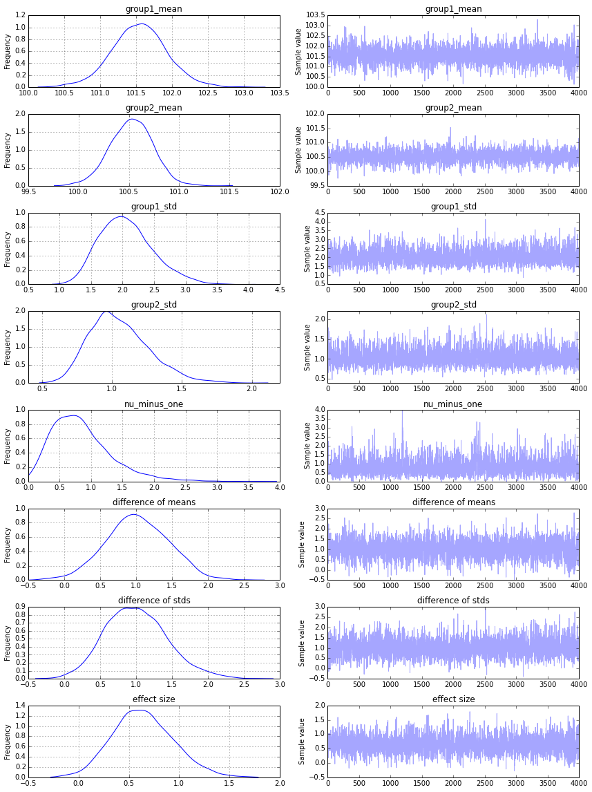

```
"""Bayesian Estimation Supersedes the T-Test

This model replicates the example used in:
Kruschke, John. (2012) Bayesian estimation supersedes the t test. Journal of Experimental Psychology: General.

The original pymc2 implementation was written by Andrew Straw and can be found here: https://github.com/strawlab/best

Ported to PyMC3 by Thomas Wiecki (c) 2015.
"""

import numpy as np
import pymc3 as pm

drug = (101,100,102,104,102,97,105,105,98,101,100,123,105,103,100,95,102,106,
        109,102,82,102,100,102,102,101,102,102,103,103,97,97,103,101,97,104,
        96,103,124,101,101,100,101,101,104,100,101)
placebo = (99,101,100,101,102,100,97,101,104,101,102,102,100,105,88,101,100,
           104,100,100,100,101,102,103,97,101,101,100,101,99,101,100,100,
           101,100,99,101,100,102,99,100,99)

y1 = np.array(drug)
y2 = np.array(placebo)
y = np.concatenate((y1, y2))

mu_m = np.mean( y )
mu_p = 0.000001 * 1/np.std(y)**2

sigma_low = np.std(y)/1000
sigma_high = np.std(y)*1000

with pm.Model() as model:
    group1_mean = pm.Normal('group1_mean', mu=mu_m, tau=mu_p, testval=y1.mean())
    group2_mean = pm.Normal('group2_mean', mu=mu_m, tau=mu_p, testval=y2.mean())
    group1_std = pm.Uniform('group1_std', lower=sigma_low, upper=sigma_high, testval=y1.std())
    group2_std = pm.Uniform('group2_std', lower=sigma_low, upper=sigma_high, testval=y2.std())
    nu = pm.Exponential('nu_minus_one', 1/29.) + 1
    
    lam1 = group1_std**-2
    lam2 = group2_std**-2

    group1 = pm.T('drug', nu=nu, mu=group1_mean, lam=lam1, observed=y1)
    group2 = pm.T('placebo', nu=nu, mu=group2_mean, lam=lam2, observed=y2)

    diff_of_means = pm.Deterministic('difference of means', group1_mean - group2_mean)
    diff_of_stds = pm.Deterministic('difference of stds', group1_std - group2_std)
    effect_size = pm.Deterministic('effect size', diff_of_means / pm.sqrt((group1_std**2 + group2_std**2) / 2))
    
    step = pm.NUTS()
    trace = pm.sample(5000, step)
```

     [-----------------100%-----------------] 5000 of 5000 complete in 29.0 sec


```
%matplotlib inline
```


```
pm.traceplot(trace[1000:]);
```





```
pm.plots.summary(trace[1000:])
```

    
    group1_mean:
     
      Mean             SD               MC Error         95% HPD interval
      -------------------------------------------------------------------
      
      101.546          0.385            0.007            [100.745, 102.275]
    
      Posterior quantiles:
      2.5            25             50             75             97.5
      |--------------|==============|==============|--------------|
      
      100.771        101.300        101.549        101.789        102.323
    
    
    group2_mean:
     
      Mean             SD               MC Error         95% HPD interval
      -------------------------------------------------------------------
      
      100.526          0.212            0.005            [100.095, 100.912]
    
      Posterior quantiles:
      2.5            25             50             75             97.5
      |--------------|==============|==============|--------------|
      
      100.101        100.383        100.532        100.667        100.922
    
    
    group1_std:
     
      Mean             SD               MC Error         95% HPD interval
      -------------------------------------------------------------------
      
      2.060            0.422            0.010            [1.266, 2.882]
    
      Posterior quantiles:
      2.5            25             50             75             97.5
      |--------------|==============|==============|--------------|
      
      1.349          1.756          2.027          2.315          2.998
    
    
    group2_std:
     
      Mean             SD               MC Error         95% HPD interval
      -------------------------------------------------------------------
      
      1.053            0.213            0.004            [0.689, 1.481]
    
      Posterior quantiles:
      2.5            25             50             75             97.5
      |--------------|==============|==============|--------------|
      
      0.705          0.905          1.029          1.184          1.524
    
    
    nu_minus_one:
     
      Mean             SD               MC Error         95% HPD interval
      -------------------------------------------------------------------
      
      0.848            0.486            0.014            [0.033, 1.789]
    
      Posterior quantiles:
      2.5            25             50             75             97.5
      |--------------|==============|==============|--------------|
      
      0.156          0.498          0.772          1.098          2.026
    
    
    difference of means:
     
      Mean             SD               MC Error         95% HPD interval
      -------------------------------------------------------------------
      
      1.020            0.441            0.008            [0.153, 1.838]
    
      Posterior quantiles:
      2.5            25             50             75             97.5
      |--------------|==============|==============|--------------|
      
      0.168          0.731          1.010          1.320          1.861
    
    
    difference of stds:
     
      Mean             SD               MC Error         95% HPD interval
      -------------------------------------------------------------------
      
      1.007            0.435            0.008            [0.197, 1.899]
    
      Posterior quantiles:
      2.5            25             50             75             97.5
      |--------------|==============|==============|--------------|
      
      0.230          0.699          0.989          1.287          1.946
    
    
    effect size:
     
      Mean             SD               MC Error         95% HPD interval
      -------------------------------------------------------------------
      
      0.643            0.302            0.006            [0.080, 1.256]
    
      Posterior quantiles:
      2.5            25             50             75             97.5
      |--------------|==============|==============|--------------|
      
      0.092          0.438          0.628          0.838          1.280
    

