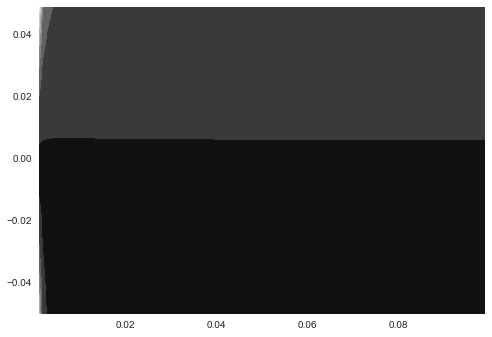

    %pylab --no-import-all inline
    
    from pymc3 import *
    import theano.tensor as T
    from numpy import random, sum as nsum, ones, concatenate, newaxis, dot, arange
    import numpy as np
    
    random.seed(1)
    
    n_groups = 1
    no_pergroup = 30
    n_observed = no_pergroup * n_groups
    n_group_predictors = 1
    n_predictors = 3
    
    group = concatenate([[i] * no_pergroup for i in range(n_groups)])
    group_predictors = random.normal(size=(n_groups, n_group_predictors))  # random.normal(size = (n_groups, n_group_predictors))
    predictors = random.normal(size=(n_observed, n_predictors))
    
    group_effects_a = random.normal(size=(n_group_predictors, n_predictors))
    effects_a = random.normal(
        size=(n_groups, n_predictors)) + dot(group_predictors, group_effects_a)
    
    y = nsum(
        effects_a[group, :] * predictors, 1) + random.normal(size=(n_observed))
    
    
    model = Model()
    with model:
    
        # m_g ~ N(0, .1)
        group_effects = Normal(
            "group_effects", 0, .1, shape=(1, n_group_predictors, n_predictors))
    
        # sg ~ Uniform(.05, 10)
        sg = Uniform("sg", .0, 10, testval=2.)
    
    
        # m ~ N(mg * pg, sg)
        effects = Normal("effects",
                         sum(group_predictors[:, :, newaxis] *
                         group_effects, 1), sg ** -2,
                         shape=(n_groups, n_predictors))
    
        s = Uniform("s", .01, 10, shape=n_groups)
    
        g = T.constant(group)
    
        # y ~ Normal(m[g] * p, s)
        yd = Normal('y', sum(effects[g] * predictors, 1), s[g] ** -2, observed=y)
    
        #start = find_MAP()
        #h = find_hessian(start)
        
    
        #step = Metropolis()
        #step = Slice()
        step = NUTS()

    Populating the interactive namespace from numpy and matplotlib

    n_predictors

    3

    group

    array([0, 0, 0, 0, 0, 0, 0, 0, 0, 0, 0, 0, 0, 0, 0, 0, 0, 0, 0, 0, 0, 0, 0,
           0, 0, 0, 0, 0, 0, 0])

    n_groups

    1

    import pymc3 as pm
    pm.debug.eval_univariate?

    model.free_RVs

    [group_effects, sg, effects, s]

    lp = lambda x, y: model.logp({'group_effects': [[[0, 0, 0]]], 'sg': x, 'effects':[[y, y, y]], 's': [.05]})
    lp = np.vectorize(lp)

    import seaborn as sns

    x, y = np.mgrid[0.001:0.1:.001, -.05:.05:.001]
    plt.contourf(x, y, lp(x, y))

    <matplotlib.contour.QuadContourSet instance at 0x7ffe77d0ccf8>

best of 3: 6.94 s per loop

    %prun -q -D sample_nuts.prof sample(3e3, step, model=model)

     [-----------------100%-----------------] 3000 of 3000 complete in 74.1 sec 
    *** Profile stats marshalled to file u'sample_nuts.prof'. 

    %prun -q -D sample.prof sample(3e3, step, start, model=model)

     [-----------------100%-----------------] 3000 of 3000 complete in 80.0 sec 
    *** Profile stats marshalled to file u'sample.prof'. 

    traceplot(trace);

