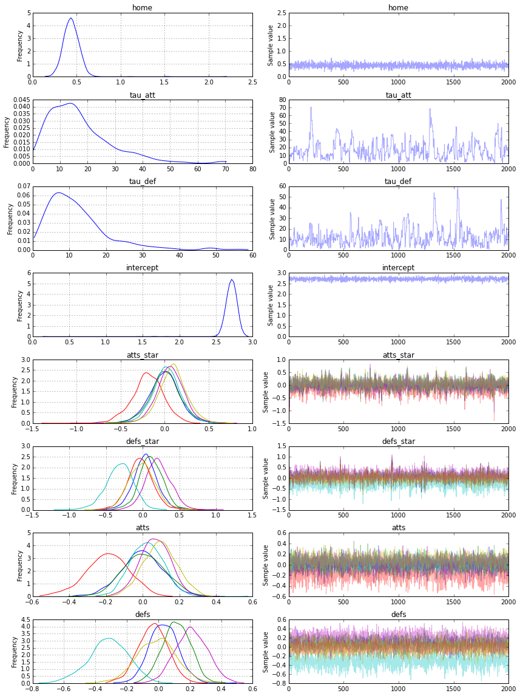

# A Hierarchical model for Rugby prediction

    
    
    import numpy as np
    import pandas as pd
    try:
        from StringIO import StringIO
    except ImportError:
        from io import StringIO
    %matplotlib inline
    import pymc3 as pm3, theano.tensor as tt

    :0: FutureWarning: IPython widgets are experimental and may change in the future.

This is a Rugby prediction exercise. So we'll input some data

    data_csv = StringIO("""home_team,away_team,home_score,away_score
    Wales,Italy,23,15
    France,England,26,24
    Ireland,Scotland,28,6
    Ireland,Wales,26,3
    Scotland,England,0,20
    France,Italy,30,10
    Wales,France,27,6
    Italy,Scotland,20,21
    England,Ireland,13,10
    Ireland,Italy,46,7
    Scotland,France,17,19
    England,Wales,29,18
    Italy,England,11,52
    Wales,Scotland,51,3
    France,Ireland,20,22""")

#The model.

The league is made up by a total of T= 6 teams, playing each other once 
in a season. We indicate the number of points scored by the home and the away team in the g-th game of the season (15 games) as $y_{g1}$ and $y_{g2}$ respectively. 

The vector of observed counts $\mathbb{y} = (y_{g1}, y_{g2})$ is modelled as independent Poisson:
$y_{gi}| \theta_{gj} \tilde\;\;  Poisson(\theta_{gj})$
where the theta parameters represent the scoring intensity in the g-th game for the team playing at home (j=1) and away (j=2), respectively.

We model these parameters according to a formulation that has been used widely in the statistical literature, assuming a log-linear random effect model:
$$log \theta_{g1} = home + att_{h(g)} + def_{a(g)} $$
$$log \theta_{g2} = att_{a(g)} + def_{h(g)}$$
the parameter home represents the advantage for the team hosting the game
and we assume that this effect is constant for all the teams and
throughout the season. 

    df = pd.read_csv(data_csv)
    
    teams = df.home_team.unique()
    teams = pd.DataFrame(teams, columns=['team'])
    teams['i'] = teams.index
    
    df = pd.merge(df, teams, left_on='home_team', right_on='team', how='left')
    df = df.rename(columns = {'i': 'i_home'}).drop('team', 1)
    df = pd.merge(df, teams, left_on='away_team', right_on='team', how='left')
    df = df.rename(columns = {'i': 'i_away'}).drop('team', 1)
    
    observed_home_goals = df.home_score.values
    observed_away_goals = df.away_score.values
    
    home_team = df.i_home.values
    away_team = df.i_away.values
    
    num_teams = len(df.i_home.drop_duplicates())
    num_games = len(home_team)
    
    g = df.groupby('i_away')
    att_starting_points = np.log(g.away_score.mean())
    g = df.groupby('i_home')
    def_starting_points = -np.log(g.away_score.mean())

    

    model = pm3.Model()
    with pm3.Model() as model:
        # global model parameters
        home        = pm3.Normal('home',      0, .0001)
        tau_att     = pm3.Gamma('tau_att',   .1, .1)
        tau_def     = pm3.Gamma('tau_def',   .1, .1)
        intercept   = pm3.Normal('intercept', 0, .0001)
        
        # team-specific model parameters
        atts_star   = pm3.Normal("atts_star", 
                               mu   =0,
                               tau  =tau_att, 
                               shape=num_teams)
        defs_star   = pm3.Normal("defs_star", 
                               mu   =0,
                               tau  =tau_def,  
                               shape=num_teams) 
     
        atts        = pm3.Deterministic('atts', atts_star - tt.mean(atts_star))
        defs        = pm3.Deterministic('defs', defs_star - tt.mean(defs_star))
        home_theta  = tt.exp(intercept + home + atts[away_team] + defs[home_team])
        away_theta  = tt.exp(intercept + atts[away_team] + defs[home_team])
        
        # likelihood of observed data
        home_points = pm3.Poisson('home_points', mu=home_theta, observed=observed_home_goals)
        away_points = pm3.Poisson('away_points', mu=away_theta, observed=observed_away_goals)

* We specified the model and the likelihood function
* Now we need to fit our model using the Maximum A Posteriori algorithm to decide where to start out No U Turn Sampler

    with model:
    
        start = pm3.find_MAP()
        step = pm3.NUTS(state=start)
        trace = pm3.sample(2000, step, start=start, progressbar=True)
    
        pm3.traceplot(trace)

     [-----------------100%-----------------] 2000 of 2000 complete in 50.1 sec

    /Users/peadarcoyle/anaconda/lib/python3.4/importlib/_bootstrap.py:321: RuntimeWarning: numpy.ndarray size changed, may indicate binary incompatibility
      return f(*args, **kwds)

    
