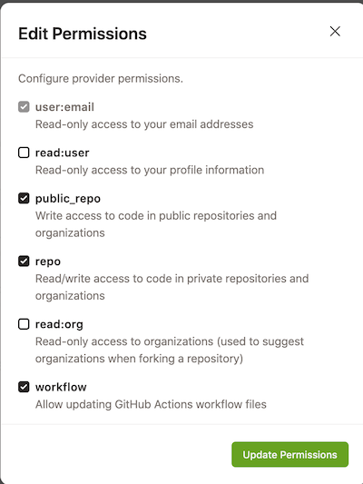
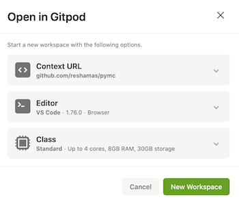

(using_gitpod)=
# Using Gitpod

## About Gitpod
[Gitpod](https://www.gitpod.io/) is a browser-based development environment.

These are some benefits to using Gitpod:

- Bypass local computer configuration and technical issues
- Save time by using a pre-configured virtual environment for contributing to open source
- Save space on your local computer

## Using Gitpod to Contribute to PyMC

These instructions are for contributing specifically to the [pymc-devs/pymc](https://github.com/pymc-devs/pymc) repo.

### Gitpod Workflow

1. Fork the pymc repo: [https://github.com/pymc-devs/pymc](https://github.com/pymc-devs/pymc)

2. Create a Gitpod account. You can login and authorize access via your GitHub account:  [https://gitpod.io/](https://gitpod.io/)

    :::{note}
    Gitpod will show up as an authorized application in your GitHub account here: [https://github.com/settings/applications](https://github.com/settings/applications)
    :::

3. Grant GitHub / Gitpod integration permissions.

   a) Go to: [https://gitpod.io/user/integrations](https://gitpod.io/user/integrations)

   b) Select GitHub and then "Edit Permissions"

   c) Select these permission: `user:email`, `public_repo`, `repo`, `workflow`

    :::{figure-md} Gitpod integration

    

    Gitpod [integration options](https://gitpod.io/user/integrations)
    :::

4. Within Gitpod, create a ["New Workspace"](https://gitpod.io/workspaces).  Here you will want to select the forked pymc repo. If you do not see it, you can paste your forked repo path into the "Context URL" box.  For example:  `https://github.com/yourusername/pymc`.  Then select "New Workspace".

    :::{figure-md} Gitpod workspace

    

    Gitpod [workspace](https://gitpod.io/workspaces)
    :::

    :::{note}
    Gitpod will pull a container and set up the workspace.  It will take a few minutes for the container to build.
    :::

5. Once Gitpod is up and running, the interface is similar to a Visual Studio Code (VSC) interface, which will appear in your browser. You will observe installation notices in the terminal window.  This can take 5-10 minutes. Once that is complete, the terminal will indicate you are on the "(base)" environment on Gitpod with your forked repo.

    Here is an example:

    ```console
    (base) gitpod@reshamas-pymc-0ygu5rf74md:/workspace/pymc$
    ```

    :::{note}
    This working environment has been set up with [micromamba](https://mamba.readthedocs.io/en/latest/user_guide/micromamba.html) which is a small, pure-C++ executable with enough functionalities to bootstrap fully functional conda-environments.
    :::

6. Check that your git remotes are correct with `git remote -v` at the terminal.

    Example:

    ```console
    (base) gitpod@reshamas-pymc-0ygu5rf74md:/workspace/pymc$ git remote -v
    origin  https://github.com/reshamas/pymc.git (fetch)
    origin  https://github.com/reshamas/pymc.git (push)
    upstream        https://github.com/pymc-devs/pymc.git (fetch)
    upstream        https://github.com/pymc-devs/pymc.git (push)
    (base) gitpod@reshamas-pymc-0ygu5rf74md:/workspace/pymc$
    ```

7. Check which version of python and pymc are being used at the terminal.

    Check the version of pymc: `pip list | grep pymc`

    Example:

    ```console
    (base) gitpod@reshamas-pymc-vpfb4pvr90z:/workspace/pymc$ pip list | grep pymc
    pymc                          5.1.0       /workspace/pymc
    pymc-sphinx-theme             0.1
    ```

    Check the version of python: `python3 --version`

    Example:

    ```console
    (base) gitpod@reshamas-pymc-vpfb4pvr90z:/workspace/pymc$ python3 --version
    Python 3.11.0
    ```

8. Syncing the repository

    Ensure you are in the correct place: 
    ```console
    cd /workspace/pymc
    git checkout main
    ```

    Sync the repository code: `git pull upstream main`

    Rebuild the source code: `pip install -e .`

    Example:
    ```console
    Obtaining file:///workspace/pymc
    Installing build dependencies ... done
    Checking if build backend supports build_editable ... done
    Getting requirements to build editable ... done
    Preparing editable metadata (pyproject.toml) ... done
    Requirement already satisfied: arviz>=0.13.0 in /opt/conda/lib/python3.11/site-packages (from pymc==5.1.1+303.g6f8f9eef) (0.15.1)
    ...
    Building editable for pymc (pyproject.toml) ... done
    Created wheel for pymc: filename=pymc-5.1.1+303.g6f8f9eef-0.editable-py3-none-any.whl size=11527 sha256=6211b7149b3ab09813b2badb3010f54d2d4ab014f75054d73f204ac5ea82ed82
    Stored in directory: /tmp/pip-ephem-wheel-cache-wmkfx8pd/wheels/73/bf/14/341b7fa040e9af1991e12077c13913921be3069fe3bdf78752
    Successfully built pymc
    Installing collected packages: pytensor, pymc
    Attempting uninstall: pytensor
    Found existing installation: pytensor 2.10.1
    Uninstalling pytensor-2.10.1:
      Successfully uninstalled pytensor-2.10.1
    Successfully installed pymc-5.1.1+303.g6f8f9eef pytensor-2.18.6
    ```

    Check the PyMC version being used: `python -c "import pymc; print(pymc.__version__)"`

    Example:
    ```console
    (base) gitpod@reshamas-pymc-syxfrf90fp0:/workspace/pymc$ python -c "import pymc; print(pymc.__version__)"
    5.1.1+303.g6f8f9eef
    ```

### Reminder: Git Workflow

:::{attention}
At the terminal, before beginning work, remember to create a feature branch:

```console
git checkout -b feature-branch
```

After working on a file, follow the Git workflow:

- `git add file_name`
- `git commit -m 'message'`
- `git push origin feature-branch`
:::

### Resources
- Video: [Using Gitpod to Contribute to PyMC](https://youtu.be/jsjOmhUaKuU) (15 minute video)

### Gitpod Notes

#### Billing
The Gitpod free plan currently allows 500 free credits per month, which is 50 hours of standard workspace usage. Usage information can be found in the [Gitpod billing section](https://gitpod.io/user/billing).

:::{caution}
Be sure to check out the Gitpod policies on [Workspace Deletion](https://www.gitpod.io/docs/configure/workspaces/workspace-lifecycle#workspace-deletion) and learn more about:

- "Starting" & "Stopping" workspaces
- "Workplace Inactivity": By default, workspaces stop following 30 minutes without user input (e.g. keystrokes or terminal input commands). You can increase the workspace timeout up to a maximum of 24 hours.
- Workspaces are deleted after 14 days. Pinned workspaces are never deleted automatically.
- You can pin a workspace from your workspace list in the Gitpod dashboard.
:::
