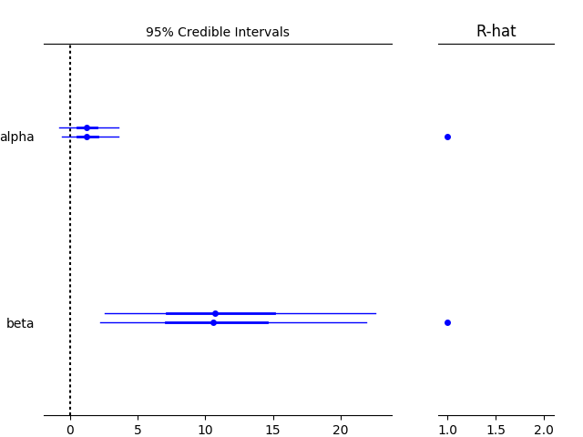

.. _intro:

************
Introduction
************

Purpose
=======

PyMC3 is a probabilistic programming package for Python that allows users to fit Bayesian models using a variety of numerical methods, most notably Markov chain Monte Carlo (MCMC) and variational inference (VI). Its flexibility and extensibility make it applicable to a large suite of problems. Along with core model specification and fitting functionality, PyMC3 includes functionality for summarizing output and for model diagnostics.

Features
========

PyMC3 strives to make Bayesian modeling as simple and painless as possible,  allowing users to focus on their scientific problem, rather than on the methods used to solve it. Here is a partial list of its features:

* Modern methods for fitting Bayesian models, including MCMC and VI.

* Includes a large suite of well-documented statistical distributions.

* Uses Theano as the computational backend, allowing for fast expression evaluation, automatic gradient calculation, and GPU computing.

* Built-in support for Gaussian process modeling.

* Model summarization and plotting.

* Model checking and convergence detection.

* Extensible: easily incorporates custom step methods and unusual probability
  distributions.

* Bayesian models can be embedded in larger programs, and results can be analyzed
  with the full power of Python.

What's new in version 3
=======================

The third major version of PyMC has benefitted from being re-written from scratch. Substantial improvements in the user interface and performance have resulted from this. While PyMC2 relied on Fortran extensions (via f2py) for most of the computational heavy-lifting, PyMC3 leverages Theano, a library from the Montréal Institute for Learning Algorithms (MILA), for array-based expression evaluation, to perform its computation. What this provides, above all else, is fast automatic differentiation, which is at the heart of the gradient-based sampling and optimization methods currently providing inference for probabilistic programming. 

Major changes from previous versions:

* New flexible object model and syntax (not backward-compatible with PyMC2).

* Gradient-based MCMC methods, including Hamiltonian Monte Carlo (HMC), the No U-turn Sampler (NUTS), and Stein Variational Gradient Descent.

* Variational inference methods, including automatic differentiation variational inference (ADVI) and operator variational inference (OPVI). 

* An interface for easy formula-based specification of generalized linear models (GLM).

* Elliptical slice sampling.

* Specialized distributions for representing time series.

* A library of Jupyter notebooks that provide case studies and fully developed usage examples.

* Much more!

While the addition of Theano adds a level of complexity to the development of PyMC, fundamentally altering how the underlying computation is performed, we have worked hard to maintain the elegant simplicity of the original PyMC model specification syntax. 

History
=======

PyMC began development in 2003, as an effort to generalize the process of
building Metropolis-Hastings samplers, with an aim to making Markov chain Monte
Carlo (MCMC) more accessible to applied scientists.
The choice to develop PyMC as a python module, rather than a standalone
application, allowed the use of MCMC methods in a larger modeling framework. By
2005, PyMC was reliable enough for version 1.0 to be released to the public. A
small group of regular users, most associated with the University of Georgia,
provided much of the feedback necessary for the refinement of PyMC to a usable
state.

In 2006, David Huard and Anand Patil joined Chris Fonnesbeck on the development
team for PyMC 2.0. This iteration of the software strives for more flexibility,
better performance and a better end-user experience than any previous version
of PyMC. PyMC 2.2 was released in April 2012. It contained numerous bugfixes and
optimizations, as well as a few new features, including improved output
plotting, csv table output, improved imputation syntax, and posterior
predictive check plots. PyMC 2.3 was released on October 31, 2013. It included 
Python 3 compatibility, improved summary plots, and some important bug fixes.

In 2011, John Salvatier began thinking about implementing gradient-based MCMC samplers, and developed the ``mcex`` package to experiment with his ideas. The following year, John was invited by the team to re-engineer PyMC to accomodate Hamiltonian Monte Carlo sampling. This led to the adoption of Theano as the computational back end, and marked the beginning of PyMC3's development. The first alpha version of PyMC3 was released in June 2015. Over the following 2 years, the core development team grew to 12 members, and the first release, PyMC3 3.0, was launched in January 2017. 

Usage Overview
==============

For a detailed overview of building models in PyMC3, please read the appropriate sections in the rest of the documentation. For a flavor of what PyMC3 models look like, here is a quick example.

First, import the PyMC3 functions and classes you will need for building your model. You can import the entire module via ``import pymc3 as pm``, or just bring in what you need::

    from pymc3 import Model, Normal, invlogit, Binomial, sample, forestplot
    import numpy as np

Models are defined using a context manager (``with`` statement). The model is specified declaratively inside the context manager, instantiating model variables and transforming them as necessary. Here is an example of a model for a bioassay experiment.

::

    # Data
    n = np.ones(4)*5
    y = np.array([0, 1, 3, 5])
    dose = np.array([-.86,-.3,-.05,.73])

    with Model() as bioassay_model:

        # Prior distributions for latent variables
        alpha = Normal('alpha', 0, sd=100)
        beta = Normal('beta', 0, sd=100)

        # Linear combinations of parameters
        theta = invlogit(alpha + beta*dose)

        # Model likelihood
        deaths = Binomial('deaths', n=n, p=theta, observed=y)

Save this file, then from a python shell (or another file in the same directory), call.

::

    with bioassay_model:
    
        # Draw wamples
        trace = sample(1000, njobs=2)
        # Plot two parameters
        forestplot(trace, varnames=['alpha', 'beta'])

This example will generate 1000 posterior samples on each of two cores using the NUTS algorithm, preceded by 500 tuning samples (the default number). The sampler is also initialized using variational inference.

::

    Auto-assigning NUTS sampler...
    Initializing NUTS using ADVI...
    Average Loss = 12.562:   6%|▌         | 11412/200000 [00:00<00:14, 12815.82it/s]
    Convergence archived at 11900
    Interrupted at 11,900 [5%]: Average Loss = 15.168
    100%|██████████████████████████████████████| 1500/1500 [00:01<00:00, 787.56it/s]

The sample is returned as arrays inside of a ``MultiTrace`` object, which is then passed to a plotting function. The resulting graphic shows a forest plot of the random variables in the model, along with a convergence diagnostic (R-hat) that indicates our model has converged.

