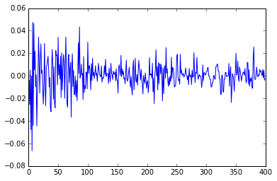
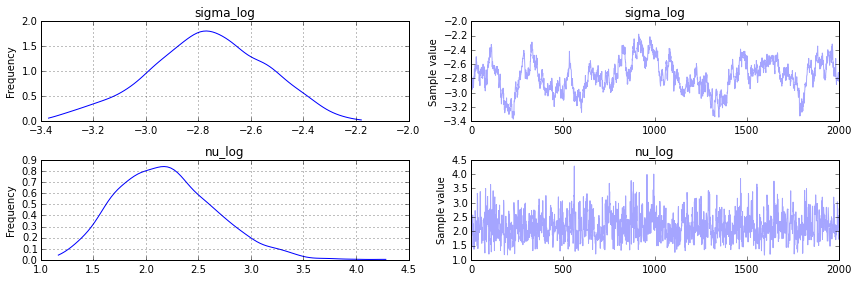

# Stochastic Volatility model

    import numpy as np
    import pymc3 as pm
    from pymc3.distributions.timeseries import GaussianRandomWalk
    
    from scipy.sparse import csc_matrix
    from scipy import optimize
    
    %pylab inline

    Populating the interactive namespace from numpy and matplotlib

    :0: FutureWarning: IPython widgets are experimental and may change in the future.

Asset prices have time-varying volatility (variance of day over day `returns`). In some periods, returns are highly variable, while in others very stable. Stochastic volatility models model this with a latent volatility variable, modeled as a stochastic process. The following model is similar to the one described in the No-U-Turn Sampler paper, Hoffman (2011) p21.

$$ \sigma \sim Exponential(50) $$

$$ \nu \sim Exponential(.1) $$

$$ s_i \sim Normal(s_{i-1}, \sigma^{-2}) $$

$$ log(\frac{y_i}{y_{i-1}}) \sim t(\nu, 0, exp(-2 s_i)) $$

Here, $y$ is the daily return series and $s$ is the latent log volatility process.

## Build Model

First we load some daily returns of the S&P 500.

    n = 400
    returns = np.genfromtxt("data/SP500.csv")[-n:]
    returns[:5]

    array([-0.00637 , -0.004045, -0.02547 ,  0.005102, -0.047733])

    plt.plot(returns)

    [<matplotlib.lines.Line2D at 0xaeaec1cc>]

Specifying the model in pymc3 mirrors its statistical specification. 

However, it is easier to sample the scale of the log volatility process innovations, $\sigma$, on a log scale, so we create it using `TransformedVar` and use `logtransform`. `TransformedVar` creates one variable in the transformed space and one in the normal space. The one in the transformed space (here $\text{log}(\sigma) $) is the one over which sampling will occur, and the one in the normal space is the one to use throughout the rest of the model.

It takes a variable name, a distribution and a transformation to use.

    model = pm.Model()
    with model:
        sigma = pm.Exponential('sigma', 1./.02, testval=.1)
    
        nu = pm.Exponential('nu', 1./10)
        s = GaussianRandomWalk('s', sigma**-2, shape=n)
    
        r = pm.T('r', nu, lam=pm.exp(-2*s), observed=returns)

## Fit Model

For this model, the full maximum a posteriori (MAP) point is degenerate and has infinite density. However, if we fix `log_sigma` and `nu` it is no longer degenerate, so we find the MAP with respect to the volatility process, 's', keeping `log_sigma` and `nu` constant at their default values. 

We use L-BFGS because it is more efficient for high dimensional functions (`s` has n elements).

    with model:
        start = pm.find_MAP(vars=[s], fmin=optimize.fmin_l_bfgs_b)

We do a short initial run to get near the right area, then start again using a new Hessian at the new starting point to get faster sampling due to better scaling. We do a short run since this is an interactive example.

    with model:
        step = pm.NUTS(vars=[s, nu,sigma],scaling=start, gamma=.25)
        start2 = pm.sample(100, step, start=start)[-1]
    
        # Start next run at the last sampled position.
        step = pm.NUTS(vars=[s, nu,sigma],scaling=start2, gamma=.55)
        trace = pm.sample(2000, step, start=start2)

     [-----------------100%-----------------] 2001 of 2000 complete in 368.9 sec

    /usr/lib/python3.4/importlib/_bootstrap.py:321: RuntimeWarning: numpy.ndarray size changed, may indicate binary incompatibility
      return f(*args, **kwds)

    figsize(12,6)
    pm.traceplot(trace, model.vars[:-1]);

    figsize(12,6)
    title(str(s))
    plot(trace[s][::10].T,'b', alpha=.03);
    xlabel('time')
    ylabel('log volatility')

    <matplotlib.text.Text at 0xac04168c>

Looking at the returns over time and overlaying the estimated standard deviation we can see how the model tracks the volatility over time.

    plot(returns)
    plot(np.exp(trace[s][::10].T), 'r', alpha=.03);
    sd = np.exp(trace[s].T)
    plot(-np.exp(trace[s][::10].T), 'r', alpha=.03);
    xlabel('time')
    ylabel('returns')

    <matplotlib.text.Text at 0xaab3854c>

## References

1. Hoffman & Gelman. (2011). [The No-U-Turn Sampler: Adaptively Setting Path Lengths in Hamiltonian Monte Carlo](http://arxiv.org/abs/1111.4246). 
