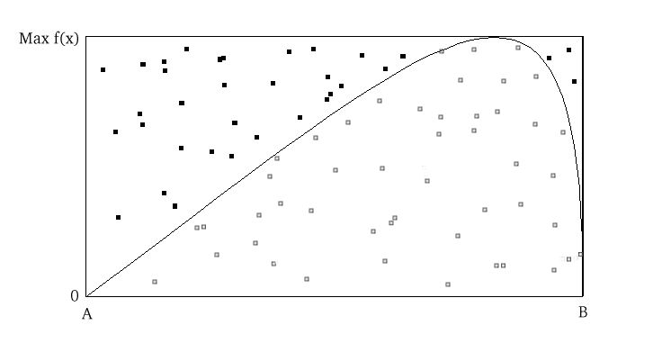

.. _chap:mcmc:

**********************************
Appendix: Markov Chain Monte Carlo
**********************************

Monte Carlo Methods in Bayesian Analysis
========================================

Bayesian analysis often requires integration over multiple dimensions that is
intractable both via analytic methods or standard methods of numerical
integration. However, it is often possible to compute these integrals by
simulating (drawing samples) from posterior distributions. For example, consider
the expected value of a random variable :math:`\mathbf{x}`:

   
.. math::
   E[{\bf x}] = \int {\bf x} f({\bf x}) d{\bf x}, \qquad
   {\bf x} = \{x_1,...,x_k\}

where :math:`k` (the dimension of vector :math:`x`) is perhaps very large. If we
can produce a reasonable number of random vectors :math:`\{{\bf x_i}\}`, we can
use these values to approximate the unknown integral. This process is known as
*Monte Carlo integration*. In general, MC integration allows integrals against
probability density functions:
   
.. math::
   I = \int h(\mathbf{x}) f(\mathbf{x}) \mathbf{dx}

to be estimated by finite sums:

   
.. math::
   \hat{I} = \frac{1}{n}\sum_{i=1}^n h(\mathbf{x}_i),

where :math:`\mathbf{x}_i` is a sample from :math:`f`. This estimate is valid
and useful because:

* By the strong law of large numbers:

     
.. math::
     \hat{I} \rightarrow I   \mbox{   with probability 1}
     
* Simulation error can be measured and controlled:

     
.. math::
  :nowrap:

     \begin{equation}Var(\hat{I}) = \frac{1}{n(n-1)}\sum_{i=1}^n (h(\mathbf{x}_i)-\hat{I})^2\end{equation}
     
Why is this relevant to Bayesian analysis? If we replace :math:`f(\mathbf{x})`
with a posterior, :math:`f(\theta|d)` and make :math:`h(\theta)` an interesting
function of the unknown parameter, the resulting expectation is that of the
posterior of :math:`h(\theta)`:

   
.. math::
  :nowrap:

   \begin{equation}
   E[h(\theta)|d] = \int f(\theta|d) h(\theta) d\theta \approx \frac{1}{n}\sum_{i=1}^n h(\theta)
   \end{equation}

Rejection Sampling
------------------

Though Monte Carlo integration allows us to estimate integrals that are
unassailable by analysis and standard numerical methods, it relies on the
ability to draw samples from the posterior distribution. For known parametric
forms, this is not a problem; probability integral transforms or bivariate
techniques (e.g Box-Muller method) may be used to obtain samples from uniform
pseudo-random variates generated from a computer. Often, however, we cannot
readily generate random values from non-standard posteriors. In such instances,
we can use rejection sampling to generate samples.

Posit a function, :math:`f(x)` which can be evaluated for any value on the
support of :math:`x:S_x = [A,B]`, but may not be integrable or easily sampled
from. If we can calculate the maximum  value of :math:`f(x)`, we can then define
a rectangle that is guaranteed to contain all possible values :math:`(x,f(x))`.
It is then trivial to generate points over the box and enumerate the values that
fall under the curve (Figure :ref:`rejection <fig:bound>`).

.. _fig:bound:

   
   Rejection sampling of a bounded form. Area is estimated by the ratio of
   accepted (open squares) to total points, multiplied by the rectangle
   area.
   
.. math::
   \frac{\mbox{Points under curve}}{\mbox{Points generated}} \times \mbox{box area} = \lim_{n \to \infty} \int_A^B f(x) dx

This approach is useful, for example, in estimating the normalizing constant for
posterior distributions.

.. _fig:unbound:

.. figure:: envelope.png
   :alt: envelope figure
   :align: center
   :scale: 100
   
   Rejection sampling of an unbounded form using an enveloping distribution.

If :math:`f(x)` has unbounded support (i.e. infinite tails), such as a Gaussian
distribution, a bounding box is no longer appropriate. We must specify a
majorizing (or, enveloping) function, :math:`g(x)`, which implies:

   
.. math::
   g(x) \ge  f(x) \qquad\forall x \in (-\infty,\infty)

Having done this, we can now sample :math:`{x_i}` from :math:`g(x)` and accept
or reject each of these values based upon :math:`f(x_i)`. Specifically, for each
draw :math:`x_i`, we also draw a uniform random variate :math:`u_i` and accept
:math:`x_i` if :math:`u_i < f(x_i)/cg(x_i)`, where :math:`c` is a constant
(Figure :ref:`unbound <fig:unbound>`). This approach is made more efficient by choosing an
enveloping distribution that is "close" to the target distribution, thus
maximizing the number of accepted points. Further improvement is gained by using
optimized algorithms such as importance sampling which, as the name implies,
samples more frequently from important areas of the distribution.

Rejection sampling is usually subject to declining performance as the dimension
of the parameter space increases, so it is used less frequently than MCMC for
evaluation of posterior distributions [Gamerman:1997]_.

Markov Chains
=============

A Markov chain is a special type of *stochastic process*. The standard
definition of a stochastic process is an ordered collection of random variables:

   
.. math::
   \{X_t:t \in T\}

where :math:`t` is frequently (but not necessarily) a time index. If we think of
:math:`X_t` as a state :math:`X` at time :math:`t`, and invoke the following
dependence condition on each state:

   
.. math::
   Pr(X_{t+1}=x_{t+1} | X_t=x_t, X_{t-1}=x_{t-1},\ldots,X_0=x_0) = Pr(X_{t+1}=x_{t+1} | X_t=x_t)

then the stochastic process is known as a Markov chain. This conditioning
specifies that the future depends on the current state, but not past states.
Thus, the Markov chain wanders about the state space, remembering only where it
has just been in the last time step. The collection of transition probabilities
is sometimes called a *transition matrix* when dealing with discrete states, or
more generally, a *transition kernel*.

In the context of Markov chain Monte Carlo, it is useful to think of the
Markovian property as "mild non-independence". MCMC allows us to indirectly
generate independent samples from a particular posterior distribution.

Jargon-busting
--------------

Before we move on, it is important to define some general properties of Markov
chains. They are frequently encountered in the MCMC literature, and some will
help us decide whether MCMC is producing a useful sample from the posterior.

* *Homogeneity*: A Markov chain is homogeneous at step :math:`t` if the
  transition probabilities are independent of time :math:`t`.

* *Irreducibility*: A Markov chain is irreducible if every state is accessible
  in one or more steps from any other state. That is, the chain contains no
  absorbing states. This implies that there is a non-zero probability of
  eventually reaching state :math:`k` from any other state in the chain.

* *Recurrence*: States which are visited repeatedly are *recurrent*. If the
  expected time to return to a particular state is bounded, this is known as
  *positive recurrence*, otherwise the recurrent state is *null recurrent*.
  Further, a chain is *Harris recurrent* when it visits all states :math:`X \in S`
  infinitely often in the limit as :math:`t \to \infty`; this is an important
  characteristic when dealing with unbounded, continuous state spaces. Whenever a
  chain ends up in a closed, irreducible set of Harris recurrent states, it stays
  there forever and visits every state with probability one.

* *Stationarity*: A stationary Markov chain produces the same marginal
  distribution when multiplied by the transition kernel.  Thus, if :math:`P` is
  some :math:`n \times n` transition matrix:

     
   .. math::
      {\bf \pi P} = {\bf \pi}
     
  for Markov chain :math:`\pi`. Thus, :math:`\pi` is no longer subscripted, and is
  referred to as the *limiting distribution* of the chain. In MCMC, the chain
  explores the state space according to its limiting marginal distribution.

* *Ergodicity*: Ergodicity is an emergent property of Markov chains which are
  irreducible, positive Harris recurrent and aperiodic. Ergodicity is defined as:

     
  .. math::
      \lim_{n \to \infty} Pr^{(n)}(\theta_i \rightarrow \theta_j) = \pi(\theta) \quad \forall \theta_i, \theta_j \in \Theta

  or in words, after many steps the marginal distribution of the chain is the same
  at one step as at all other steps. This implies that our Markov chain, which we
  recall is dependent, can generate samples that are independent if we wait long
  enough between samples. If it means anything to you, ergodicity is the analogue
  of the strong law of large numbers for Markov chains. For example, take values
  :math:`\theta_{i+1},\ldots,\theta_{i+n}` from a chain that has reached an
  ergodic state. A statistic of interest can then be estimated by:

     
  .. math::
     \frac{1}{n}\sum_{j=i+1}^{i+n} h(\theta_j) \approx \int f(\theta) h(\theta) d\theta

Why MCMC Works: Reversible Markov Chains
========================================

Markov chain Monte Carlo simulates a Markov chain for which some function of
interest (*e.g.* the joint distribution of the parameters of some model) is the
unique, invariant limiting distribution. An invariant distribution with respect
to some Markov chain with transition kernel :math:`Pr(y \mid x)` implies that:

   
.. math::
   \int_x Pr(y \mid x) \pi(x) dx = \pi(y).

Invariance is guaranteed for any **reversible** Markov chain. Consider a Markov
chain in reverse sequence:
:math:`\{\theta^{(n)},\theta^{(n-1)},...,\theta^{(0)}\}`. This sequence is still
Markovian, because:

   
.. math::
   Pr(\theta^{(k)}=y \mid \theta^{(k+1)}=x,\theta^{(k+2)}=x_1,\ldots ) = Pr(\theta^{(k)}=y \mid \theta^{(k+1)}=x)

Forward and reverse transition probabilities may be related through Bayes
theorem:

.. math::
   
.. \begin{eqnarray}
.. Pr(\theta^{(k)}=y \mid \theta^{(k+1)}=x) &=& \frac{Pr(\theta^{(k+1)}=x \mid \theta^{(k)}=y) Pr(\theta^{(k)}=y)}{Pr(\theta^{(k+1)}=x)}  \\
.. &=& \frac{Pr(\theta^{(k+1)}=x \mid \theta^{(k)}=y) \pi^{(k)}(y)}{\pi^{(k+1)}(x)}
.. \end{eqnarray}

   
.. math::
   \frac{Pr(\theta^{(k+1)}=x \mid \theta^{(k)}=y) \pi^{(k)}(y)}{\pi^{(k+1)}(x)}

Though not homogeneous in general, :math:`\pi` becomes homogeneous if **Do you
ever call the stationary distribution itself homogeneous?**:

* :math:`n \rightarrow \infty`

* :math:`\pi^{(0)}=\pi` for some :math:`i < k` **Is it meant to be
  :math:`\pi^(i)`, and **

If this chain is homogeneous it is called reversible, because it satisfies the
**detailed balance equation**:

   
.. math::
   \pi(x)Pr(y \mid x) = \pi(y) Pr(x \mid y)

Reversibility is important because it has the effect of balancing movement
through the entire state space. When a Markov chain is reversible, :math:`\pi`
is the unique, invariant, stationary distribution of that chain. Hence, if
:math:`\pi` is of interest, we need only find the reversible Markov chain for
which :math:`\pi` is the limiting distribution. This is what MCMC does!

Gibbs Sampling
==============

The Gibbs sampler is the simplest and most prevalent MCMC algorithm. If a
posterior has :math:`k` parameters to be estimated, we may condition each
parameter on current values of the other :math:`k-1` parameters, and sample from
the resultant distributional form (usually easier), and repeat this operation on
the other parameters in turn. This procedure generates samples from the
posterior distribution. Note that we have now combined Markov chains
(conditional independence) and Monte Carlo techniques (estimation by simulation)
to yield Markov chain Monte Carlo.

Here is a stereotypical Gibbs sampling algorithm:

As we can see from the algorithm, each distribution is conditioned on the last
iteration of its chain values, constituting a Markov chain as advertised. The
Gibbs sampler has all of the important properties outlined in the previous
section: it is aperiodic, homogeneous and ergodic. Once the sampler converges,
all subsequent samples are from the target distribution. This convergence occurs
at a geometric rate.

#. Choose starting values for states (parameters): :math:`{\bf \theta} = [\theta_1^{(0)},\theta_2^{(0)},\ldots,\theta_k^{(0)}]`
#. Initialize counter :math:`j=1`
#. Draw the following values from each of the :math:`k` conditional distributions:

   .. math::
      :nowrap:
   
      \begin{eqnarray*}
      \theta_1^{(j)} &\sim& \pi(\theta_1 | \theta_2^{(j-1)},\theta_3^{(j-1)},\ldots,\theta_{k-1}^{(j-1)},\theta_k^{(j-1)}) \\
      \theta_2^{(j)} &\sim& \pi(\theta_2 | \theta_1^{(j)},\theta_3^{(j-1)},\ldots,\theta_{k-1}^{(j-1)},\theta_k^{(j-1)}) \\
      \theta_3^{(j)} &\sim& \pi(\theta_3 | \theta_1^{(j)},\theta_2^{(j)},\ldots,\theta_{k-1}^{(j-1)},\theta_k^{(j-1)}) \\
      \vdots \\
      \theta_{k-1}^{(j)} &\sim& \pi(\theta_{k-1} | \theta_1^{(j)},\theta_2^{(j)},\ldots,\theta_{k-2}^{(j)},\theta_k^{(j-1)}) \\
      \theta_k^{(j)} &\sim& \pi(\theta_k | \theta_1^{(j)},\theta_2^{(j)},\theta_4^{(j)},\ldots,\theta_{k-2}^{(j)},\theta_{k-1}^{(j)})
      \end{eqnarray*}

#. Increment :math:`j` and repeat until convergence occurs.

The Metropolis-Hastings Algorithm
=================================

The key to success in applying the Gibbs sampler to the estimation of Bayesian
posteriors is being able to specify the form of the complete conditionals of
:math:`{\bf \theta}`. In fact, the algorithm cannot be implemented without them.
Of course, the posterior conditionals cannot always be neatly specified. In
contrast to the Gibbs algorithm, the Metropolis-Hastings algorithm generates
candidate state transitions from an alternate distribution, and accepts or
rejects each candidate probabilistically.

Let us first consider a simple Metropolis-Hastings algorithm for a single
parameter, :math:`\theta`. We will use a standard sampling distribution,
referred to as the *proposal distribution*, to produce candidate variables
:math:`q_t(\theta^{\prime} | \theta)`. That is, the generated value,
:math:`\theta^{\prime}`, is a *possible* next value for :math:`\theta` at step
:math:`t+1`. We also need to be able to calculate the probability of moving back
to the original value from the candidate, or
:math:`q_t(\theta | \theta^{\prime})`. These probabilistic ingredients are used
to define an *acceptance ratio*:

   
.. math::
   a(\theta^{\prime},\theta) = \frac{q_t(\theta^{\prime} | \theta) \pi(\theta^{\prime})}{q_t(\theta | \theta^{\prime}) \pi(\theta)}

The value of :math:`\theta^{(t+1)}` is then determined by:

.. math::
   \theta^{(t+1)} = \left\{\begin{array}{l@{\quad \mbox{with prob.} \quad}l}\theta^{\prime} & \min(a(\theta^{\prime},\theta),1) \\ \theta^{(t)} & 1 - \min(a(\theta^{\prime},\theta),1) \end{array}\right.

This transition kernel implies that movement is not guaranteed at every step. It
only occurs if the suggested transition is likely based on the acceptance ratio.

A single iteration of the Metropolis-Hastings algorithm proceeds as follows:

The original form of the algorithm specified by Metropolis required that
:math:`q_t(\theta^{\prime} | \theta) = q_t(\theta | \theta^{\prime})`, which
reduces :math:`a(\theta^{\prime},\theta)` to
:math:`\pi(\theta^{\prime})/\pi(\theta)`, but this is not necessary. In either
case, the state moves to high-density points in the distribution with high
probability, and to low-density points with low probability. After convergence,
the Metropolis-Hastings algorithm describes the full target posterior density,
so all points are recurrent.

#. Sample :math:`\theta^{\prime}` from :math:`q(\theta^{\prime} | \theta^{(t)})`.
#. Generate a Uniform[0,1] random variate :math:`u`.
#. If :math:`a(\theta^{\prime},\theta) > u` then :math:`\theta^{(t+1)} = \theta^{\prime}`, otherwise :math:`\theta^{(t+1)} = \theta^{(t)}`.

Random-walk Metropolis-Hastings
-------------------------------

A practical implementation of the Metropolis-Hastings algorithm makes use of a
random-walk proposal. Recall that a random walk is a Markov chain that evolves
according to:

.. math::
  :nowrap:

  \begin{eqnarray*}
  \theta^{(t+1)} &=& \theta^{(t)} + \epsilon_t \\
  \epsilon_t &\sim& f(\phi)
  \end{eqnarray*}

As applied to the MCMC sampling, the random walk is used as a proposal
distribution, whereby dependent proposals are generated according to:

   
.. math::
   q(\theta^{\prime} | \theta^{(t)}) = f(\theta^{\prime} - \theta^{(t)}) = \theta^{(t)} + \epsilon_t

Generally, the density generating :math:`\epsilon_t` is symmetric about zero,
resulting in a symmetric chain. Chain symmetry implies that
:math:`q(\theta^{\prime} | \theta^{(t)}) = q(\theta^{(t)} | \theta^{\prime})`,
which reduces the Metropolis-Hastings acceptance ratio to:

   
.. math::
   a(\theta^{\prime},\theta) = \frac{\pi(\theta^{\prime})}{\pi(\theta)}

The choice of the random walk distribution for :math:`\epsilon_t` is frequently
a normal or Student's :math:`t` density, but it may be any distribution that
generates an irreducible proposal chain.

An important consideration is the specification of the scale parameter for the
random walk error distribution. Large values produce random walk steps that are
highly exploratory, but tend to produce proposal values in the tails of the
target distribution, potentially resulting in very small acceptance rates.
Conversely, small values tend to be accepted more frequently, since they tend to
produce proposals close to the current parameter value, but may result in chains
that mix very slowly. Some simulation studies suggest optimal acceptance rates
in the range of 20-50%. It is often worthwhile to optimize the proposal variance
by iteratively adjusting its value, according to observed acceptance rates early
in the MCMC simulation [Gamerman:1997]_.

