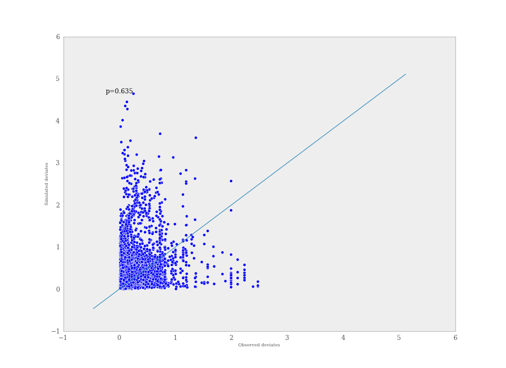

.. _chap_modelchecking:

******************************
Model checking and diagnostics
******************************
    

Convergence Diagnostics
=======================

Valid inferences from sequences of MCMC samples are based on the assumption that the samples are derived from the true posterior distribution of interest. Theory guarantees this condition as the number of iterations approaches infinity. It is important, therefore, to determine the minimum number of samples required to ensure a reasonable approximation to the target posterior density. Unfortunately, no universal threshold exists across all problems, so convergence must be assessed independently each time MCMC estimation is performed. The procedures for verifying convergence are collectively known as convergence diagnostics.

One approach to analyzing convergence is analytical, whereby the variance of the sample at different sections of the chain are compared to that of the limiting distribution. These methods use distance metrics to analyze convergence, or place theoretical bounds on the sample variance, and though they are promising, they are generally difficult to use and are not prominent in the MCMC literature. More common is a statistical approach to assessing convergence. With this approach, rather than considering the properties of the theoretical target distribution, only the statistical properties of the observed chain are analyzed. Reliance on the sample alone restricts such convergence criteria to heuristics; that is, convergence cannot be guaranteed. Although evidence for lack of convergence using statistical convergence diagnostics will correctly imply lack of convergence in the chain, the absence of such evidence will not *guarantee* convergence in the chain. Nevertheless, negative results for one or more criteria will provide some measure of assurance to most users that their sample will provide valid inferences.

For most simple models, convergence will occur quickly, sometimes within a the first several hundred iterations, after which all remaining samples of the chain may be used to calculate posterior quantities. For many more complex models, convergence requires a significantly longer burn-in period; sometimes orders of magnitude more samples are needed. Frequently, lack of convergence will be caused by poor mixing (Figure :ref:`mix`). Recall that *mixing* refers to the degree to which the Markov chain explores the support of the posterior distribution. Poor mixing may stem from inappropriate proposals (if one is using the Metropolis-Hastings sampler) or from attempting to estimate models with highly correlated variables.

.. _mix:

.. figure:: _images/poormixing.*
   :alt: Poor mixing figure
   :align: center

   An example of a poorly-mixing sample in two dimensions. Notice that the
   chain is trapped in a region of low probability relative to the mean
   (dot) and variance (oval) of the true posterior quantity.

Informal Methods
----------------

The most straightforward approach for assessing convergence is based on simply plotting and inspecting traces and histograms of the observed MCMC sample. If the trace of values for each of the stochastics exhibits asymptotic behavior [#]_ over the last :math:`m` iterations, this may be satisfactory evidence for convergence. A similar approach involves plotting a histogram for every set of :math:`k` iterations (perhaps 50-100) beyond some burn in threshold :math:`n`; if the histograms are not visibly different among the sample intervals, this is reasonable evidence for convergence. Note that such diagnostics should be carried out for each stochastic estimated by the MCMC algorithm, because convergent behavior by one variable does not imply evidence for convergence for other variables in the analysis. An extension of this approach can be taken when multiple parallel chains are run, rather than just a single, long chain. In this case, the final values of :math:`c` chains run for :math:`n` iterations are plotted in a histogram; just as above, this is repeated every :math:`k` iterations thereafter, and the histograms of the endpoints are plotted again and compared to the previous histogram. This is repeated until consecutive histograms are indistinguishable.

Another *ad hoc* method for detecting lack of convergence is to examine the traces of several MCMC chains initialized with different starting values. Overlaying these traces on the same set of axes should (if convergence has occurred) show each chain tending toward the same equilibrium value, with approximately the same variance. Recall that the tendency for some Markov chains to converge to the true (unknown) value from diverse initial values is called *ergodicity*. This property is guaranteed by the reversible chains constructed using MCMC, and should be observable using this technique. Again, however, this approach is only a heuristic method, and cannot always detect lack of convergence, even though chains may appear ergodic.

.. _metas:

.. figure:: _images/metastable.*
   :align: center
   
   An example of metastability in a two-dimensional parameter space. The
   chain appears to be stable in one region of the parameter space for an
   extended period, then unpredictably jumps to another region of the
   space.

A principal reason that evidence from informal techniques cannot guarantee convergence is a phenomenon called metastability. Chains may appear to have converged to the true equilibrium value, displaying excellent qualities by any of the methods described above. However, after some period of stability around this value, the chain may suddenly move to another region of the parameter space (Figure :ref:`metas`). This period of metastability can sometimes be very long, and therefore escape detection by these convergence diagnostics. Unfortunately, there is no statistical technique available for detecting metastability.

Formal Methods
--------------

Along with the *ad hoc* techniques described above, a number of more formal methods exist which are prevalent in the literature. These are considered more formal because they are based on existing statistical methods, such as time series analysis.

PyMC currently includes two formal convergence diagnostic methods. The first, proposed by [Geweke_1992]_, is a time-series approach that compares the mean and variance of segments from the beginning and end of a single chain.

   
.. math::
   z = \frac{\bar{\theta}_a - \bar{\theta}_b}{\sqrt{Var(\theta_a) + Var(\theta_b)}}

   
where :math:`a` is the early interval and :math:`b` the late interval. If the z-scores (theoretically distributed as standard normal variates) of these two segments are similar, it can provide evidence for convergence. PyMC calculates z-scores of the difference between various initial segments along the chain, and the last 50% of the remaining chain. If the chain has converged, the majority of points should fall within 2 standard deviations of zero.

Diagnostic z-scores can be obtained by calling the ``geweke`` function. It accepts either (1) a single trace, (2) a Node or Stochastic object, or (4) an entire Model object::

   geweke(x, first=0.1, last=0.5, intervals=20)

The arguments expected are the following:

* ``pymc_object``: The object that is or contains the output trace(s).

* ``first`` (optional): First portion of chain to be used in Geweke diagnostic. Defaults to 0.1 (*i.e.* first 10% of chain).

* ``last`` (optional): Last portion of chain to be used in Geweke diagnostic. Defaults to 0.5 (*i.e.* last 50% of chain).

* ``intervals`` (optional): Number of sub-chains to analyze. Defaults to 20.

The resulting scores are best interpreted graphically, using the ``geweke_plot`` function. This displays the scores in series, in relation to the 2 standard deviation boundaries around zero. Hence, it is easy to see departures from the standard normal assumption.

.. _geweke:

.. figure:: _images/geweke.*
   :align: center
   :alt: Geweke figure.
   
   Sample plot of Geweke z-scores for a variable using ``geweke_plot``.
   The occurrence of the scores well within 2 standard deviations of zero
   gives not indicate of lack of convergence (top), while deviations exceeding 
   2 standard deviations suggest that additional samples are requred to 
   achieve convergence (bottom).
	
``geweke_plot`` takes either a single set of scores, or a dictionary of scores (output by ``geweke`` when an entire Sampler is passed) as its argument::

   def geweke_plot(scores, name='geweke', format='png', suffix='-diagnostic', 
                   path='./', fontmap = {1:10, 2:8, 3:6, 4:5, 5:4}, verbose=1)

The arguments are defined as:

* ``scores``: The object that contains the Geweke scores. Can be a list (one set) or a dictionary (multiple sets).

* ``name`` (optional): Name used for output files. For multiple scores, the dictionary keys are used as names.

* ``format`` (optional): Graphic output file format (defaults to *png*).

* ``suffix`` (optional): Suffix to filename (defaults to *-diagnostic*)

* ``path`` (optional): The path for output graphics (defaults to working directory).

* ``fontmap`` (optional): Dictionary containing the font map for the labels of the graphic.

* ``verbose`` (optional): Verbosity level for output (defaults to 1).

To illustrate, consider a model ``my_model`` that is used to instantiate a MCMC sampler. The sampler is then run for a given number of iterations::

   >>> S = pymc.MCMC(my_model)
   >>> S.sample(10000, burn=5000)

It is easiest simply to pass the entire sampler ``S`` the ``geweke`` function::

   >>> scores = pymc.geweke(S, intervals=20)
   >>> pymc.Matplot.geweke_plot(scores)

Alternatively, individual stochastics within ``S`` can be analyzed for convergence::

   >>> trace = S.alpha.trace()
   >>> alpha_scores = pymc.geweke(trace, intervals=20)
   >>> pymc.Matplot.geweke_plot(alpha_scores, 'alpha')

An example of convergence and non-convergence of a chain using `geweke_plot` is given in Figure :ref:`geweke` .

The second diagnostic provided by PyMC is the [Raftery_1995a]_ procedure. This approach estimates the number of iterations required to reach convergence, along with the number of burn-in samples to be discarded and the appropriate thinning interval. A separate estimate of both quantities can be obtained for each variable in a given model.

As the criterion for determining convergence, the Raftery and Lewis approach uses the accuracy of estimation of a user-specified quantile. For example, we may want to estimate the quantile :math:`q=0.975` to within :math:`r=0.005` with probability :math:`s=0.95`. In other words,
   
.. math::
   	Pr(|\hat{q}-q| \le r) = s

From any sample of :math:`\theta`, one can construct a binary chain:

.. math::
   	Z^{(j)} = I(\theta^{(j)} \le u_q)

where :math:`u_q` is the quantile value and :math:`I` is the indicator function. While :math:`\{\theta^{(j)}\}` is a Markov chain, :math:`\{Z^{(j)}\}` is not necessarily so. In any case, the serial dependency among :math:`Z^{(j)}` decreases as the thinning interval :math:`k` increases. A value of :math:`k` is chosen to be the smallest value such that the first order Markov chain is preferable to the second order Markov chain.

This thinned sample is used to determine number of burn-in samples. This is done by comparing the remaining samples from burn-in intervals of increasing length to the limiting distribution of the chain. An appropriate value is one for which the truncated sample's distribution is within :math:`\epsilon` (arbitrarily small) of the limiting distribution. See [Raftery_1995a]_ or [Gamerman_1997]_ for computational details. Estimates for sample size tend to be conservative.

This diagnostic is best used on a short pilot run of a particular model, and the results used to parameterize a subsequent sample that is to be used for inference. Its calling convention is as follows::

   raftery_lewis(x, q, r, s=.95, epsilon=.001, verbose=1)

The arguments are:

* ``pymc_object``: The object that contains the Geweke scores. Can be a list (one set) or a dictionary (multiple sets).

* ``q``: Desired quantile to be estimated.

* ``r``: Desired accuracy for quantile.

* ``s`` (optional): Probability of attaining the requested accuracy (defaults
  to 0.95).

* ``epsilon`` (optional) : Half width of the tolerance interval required for the q-quantile (defaults to 0.001).

* ``verbose`` (optional) : Verbosity level for output (defaults to 1).

The code for ``raftery_lewis`` is based on the FORTRAN program *gibbsit* ([Raftery_1995b]_).

For example, consider again a sampler S run for some model my_model::

	>>> S = pymc.MCMC(my_model) 
	>>> S.sample(10000, burn=5000)
	
One can pass either the entire sampler S or any stochastic within S to the `raftery_lewis` function, along with suitable arguments. Here, we have chosen :math:`q = 0.025` (the lower limit of the equal-tailed 95% interval) and error :math:`r = 0.01`::

	>>> pymc.raftery_lewis(S, q=0.025, r=0.01)

This yields diagnostics as follows for each stochastic of S, as well as a dictionary containing the diagnostic quantities::

	======================== 
	Raftery-Lewis Diagnostic 
	========================
	
	937 iterations required (assuming independence) to achieve 0.01 accuracy 
	with 95 percent probability.

	Thinning factor of 1 required to produce a first-order Markov chain. 
	
	39 iterations to be discarded at the beginning of the simulation (burn-in). 
	
	11380 subsequent iterations required. 
	
	Thinning factor of 11 required to produce an independence chain.

Additional convergence diagnostics are available in the `R`_ statistical
package ([R_2010]_), via the `CODA`_ module ([Plummer_2008]_). PyMC includes a method ``coda`` for exporting model traces in a format that may be directly read by ``coda``::

   pymc.utils.coda(pymc_object)

The lone argument is the PyMC sampler for which output is desired.

Calling ``coda`` yields a file containing raw trace values (suffix ``.out``) and a file containing indices to the trace values (suffix ``.ind``).

.. _`R`: http://lib.stat.cmu.edu/r/cran/

.. _`CODA`: http://www-fis.iarc.fr/coda/

.. % section convergence_diagnostics (end)

Autocorrelation Plots
=====================

Samples from MCMC algorithms are ususally autocorrelated, due partly to the inherent Markovian dependence structure. The degree of autocorrelation can be quantified using the autocorrelation function: 

.. math::

   \rho_k & = \frac{\mbox{Cov}(X_t,  X_{t+k})}{\sqrt{\mbox{Var}(X_t)\mbox{Var}(X_{t+k})}}
   
         & = \frac{E[(X_t - \theta)(X_{t+k} - \theta)]}{\sqrt{E[(X_t - \theta)^2] E[(X_{t+k} - \theta)^2]}}

PyMC includes a function for plotting the autocorrelation function for each stochastics in the sampler (Figure :ref:`autocorr`). This allows users to examine the relationship among successive samples within sampled chains. Significant autocorrelation suggests that chains require thinning prior to use of the posterior statistics for inference.

::

   autocorrelation(pymc_object, name, maxlag=100, format='png', suffix='-acf',
   path='./', fontmap = {1:10, 2:8, 3:6, 4:5, 5:4}, verbose=1)

* ``pymc_object``: The object that is or contains the output trace(s).

* ``name``: Name used for output files.

* ``maxlag``: The highest lag interval for which autocorrelation is calculated.

* ``format`` (optional): Graphic output file format (defaults to *png*).

* ``suffix`` (optional): Suffix to filename (defaults to *-diagnostic*)

* ``path`` (optional): The path for output graphics (defaults to working directory).

* ``fontmap`` (optional): Dictionary containing the font map for the labels of the graphic.

* ``verbose`` (optional): Verbosity level for output (defaults to 1).

Using any given model `my_model` as an example, autocorrelation plots can be obtained simply by passing the sampler for that model to the `autocorrelation` function (within the `Matplot` module) directly::

	>>> S = pymc.MCMC(my_model) 
	>>> S.sample(10000, burn=5000) 
	>>> pymc.Matplot.autocorrelation(S)
	
Alternatively, variables within a model can be plotted individually. For example, a hypothetical variable `beta` that was estimated using sampler `S` will yield a correlation plot as follows::

	>>> pymc.Matplot.autocorrelation(S.beta)

.. _autocorr:

.. figure:: _images/autocorr.*
   :align: center
   :alt: Autocorrelation figure
   :scale: 70
   
   Sample autocorrelation plots for two Poisson variables from coal mining
   disasters example model.

.. % section autocorrelation_plots (end)

Goodness of Fit
===============

Checking for model convergence is only the first step in the evaluation of MCMC model outputs. It is possible for an entirely unsuitable model to converge, so additional steps are needed to ensure that the estimated model adequately fits the data. One intuitive way for evaluating model fit is to compare model predictions with actual observations. In other words, the fitted model can be used to simulate data, and the distribution of the simulated data should resemble the distribution of the actual data.

Fortunately, simulating data from the model is a natural component of the Bayesian modelling framework. Recall, from the discussion on imputation of missing data, the posterior predictive distribution:

   
.. math::
   	p(\tilde{y}|y) = \int p(\tilde{y}|\theta) f(\theta|y) d\theta
   
   
Here, :math:`\tilde{y}` represents some hypothetical new data that would be expected, taking into account the posterior uncertainty in the model parameters. Sampling from the posterior predictive distribution is easy in PyMC. The code looks identical to the corresponding data stochastic, with two modifications: (1) the node should be specified as deterministic and (2) the statistical likelihoods should be replaced by random number generators. As an example, consider a simple dose-response model, where deaths are modeled as a binomial random variable for which the probability of death is a logit-linear function of the dose of a particular drug::

   n = [5]*4 
	dose = [-.86,-.3,-.05,.73] 
	x = [0,1,3,5]

	alpha = pymc.Normal('alpha', mu=0.0, tau=0.01) 
	beta = pymc.Normal('beta', mu=0.0, tau=0.01)

	@pymc.deterministic 
	def theta(a=alpha, b=beta, d=dose):
		"""theta = inv_logit(a+b)""" 
		return pymc.invlogit(a+b*d)
		
	"""deaths ~ binomial(n, p)""" 
	deaths = pymc.Binomial('deaths', n=n, p=theta, value=x, observed=True)

The posterior predictive distribution of deaths uses the same functional form as the data likelihood, in this case a binomial stochastic. Here is the corresponding sample from the posterior predictive distribution::

	@pymc.deterministic 
	def deaths_sim(n=n, p=theta):
		"""deaths_sim = rbinomial(n, p)""" 
		return pymc.rbinomial(n, p)

Notice that the stochastic `pymc.Binomial` has been replaced with a deterministic node that simulates values using `pymc.rbinomial` and the unknown parameters `theta`.

The degree to which simulated data correspond to observations can be evaluated in at least two ways. First, these quantities can simply be compared visually. This allows for a qualitative comparison of model-based replicates and observations. If there is poor fit, the true value of the data may appear in the tails of the histogram of replicated data, while a good fit will tend to show the true data in high-probability regions of the posterior predictive distribution (Figure :ref:`gof`).

.. _gof:

.. figure:: _images/gof.*
   :align: center
   :alt: GOF figure
   :scale: 70
   
   Data sampled from the posterior predictive distribution of a model for
   some observation :math:`\mathbf{x}`. The true value of
   :math:`\mathbf{x}` is shown by the dotted red line.

The Matplot package in PyMC provides an easy way of producing such plots, via the ``gof_plot`` function. To illustrate, consider a single data point ``x`` and an array of values ``x_sim`` sampled from the posterior predictive distribution. The histogram is generated by calling::

   pymc.Matplot.gof_plot(x_sim, x, name='x')

A second approach for evaluating goodness of fit using samples from the posterior predictive distribution involves the use of a statistical criterion. For example, the Bayesian p-value [Gelman_1996]_ uses a discrepancy measure that quantifies the difference between data (observed or simulated) and the expected value, conditional on some model. One such discrepancy measure is the Freeman-Tukey statistic [Brooks_2000]_:

.. math::

   	D(x|\theta) = \sum_j (\sqrt{x_j}-\sqrt{e_j})^2

Model fit is assessed by comparing the discrepancies from observed data to those from simulated data. On average, we expect the difference between them to be zero; hence, the Bayesian *p* value is simply the proportion of simulated discrepancies that are larger than their corresponding observed discrepancies:

.. math::
   	p = Pr[ D(\text{sim}) > D(\text{obs}) ]

If :math:`p` is very large (e.g. :math:`>0.975`) or very small (e.g. :math:`<0.025`) this implies that the model is not consistent with the data, and thus is evidence of lack of fit. Graphically, data and simulated discrepancies plotted together should be clustered along a 45 degree line passing through the origin, as shown in Figure :ref:`deviate`.

.. _deviate:

   
   Plot of deviates of observed and simulated data from expected values.
   The cluster of points symmetrically about the 45 degree line (and the
   reported p-value) suggests acceptable fit for the modeled parameter.

The ``discrepancy`` function in the ``diagnostics`` package can be used to generate discrepancy statistics from arrays of data, simulated values, and expected values::

   D = pymc.utils.discrepancy(x, x_sim, x_exp)

A call to this function returns two arrays of discrepancy values, which can be passed to the ``discrepancy_plot`` function in the `Matplot` module to generate a scatter plot, and if desired, a *p* value::

   pymc.Matplot.discrepancy_plot(D, name='D', report_p=True)

Additional optional arguments for ``discrepancy_plot`` are identical to other PyMC plotting functions.

.. % section goodness_of_fit (end)

.. rubric:: Footnotes

.. [#] Asymptotic behaviour implies that the variance and the mean value of the sample
   stays relatively constant over some arbitrary period.